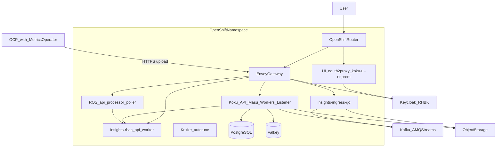

# C4 architecture documentation plan

## Goal

Produce **workspace-owned** architecture docs under `[docs/](docs/)` (does not exist today) that describe the **entire on-prem Cost Management system** in [C4 model](https://c4model.com/) form. Research starts at `[submodules/cost-onprem-chart](submodules/cost-onprem-chart)` (deployment SoT) and extends into application repos (`koku`, `koku-ui`, `insights-rbac-ui`) and cluster-external prerequisites.

Existing chart assets remain authoritative for ops detail; the new docs **synthesize and cross-link** rather than duplicate `[submodules/cost-onprem-chart/docs/](submodules/cost-onprem-chart/docs/)`.

## Scope boundaries


| In scope                                                           | Out of scope (link only)                                   |
| ------------------------------------------------------------------ | ---------------------------------------------------------- |
| On-prem OpenShift deployment (chart + install scripts)             | SaaS/console.redhat.com topology (mention in context only) |
| C4 Levels 1–3 for platform + Koku/UI drill-down                    | C4 Level 4 (code/classes)                                  |
| External deps: Keycloak, Kafka, S3, bundled/external DB & Valkey   | Full Helm values reference                                 |
| OCP **Cost Management Metrics Operator** as external data producer | Per-template YAML inventory                                |


## Source material (read-only research trail)

Primary anchors already identified:

- **Deployment topology:** `[cost-onprem/values.yaml](submodules/cost-onprem-chart/cost-onprem/values.yaml)` header + keys `ros`, `costManagement`, `ingress`, `rbac`, `kruize`, `ui`, `database`, `valkey`, `kafka`, `jwtAuth`
- **Single umbrella chart, no subcharts:** `[cost-onprem/Chart.yaml](submodules/cost-onprem-chart/cost-onprem/Chart.yaml)` (`dependencies: []`)
- **Routing & auth:** `[docs/architecture/platform-guide.md](submodules/cost-onprem-chart/docs/architecture/platform-guide.md)`, `[templates/gateway/configmap-envoy.yaml](submodules/cost-onprem-chart/cost-onprem/templates/gateway/configmap-envoy.yaml)`, `[docs/operations/rbac-setup.md](submodules/cost-onprem-chart/docs/operations/rbac-setup.md)`
- **Data pipeline:** `[docs/data-processing-flow.svg](submodules/cost-onprem-chart/docs/data-processing-flow.svg)`, `[submodules/koku/docs/onprem_data_flow.md](submodules/koku/docs/onprem_data_flow.md)`
- **Repo mapping:** `[constitutions/cost-onprem-chart/constitution.md](constitutions/cost-onprem-chart/constitution.md)`, `[submodules/koku/AGENTS.md](submodules/koku/AGENTS.md)`, wiki `[entities/flpath-4164-rbac-mfe-poc.md](wiki/entities/flpath-4164-rbac-mfe-poc.md)`

**Prerequisites not rendered by Helm** (document as external containers in C4 Context):

- **Kafka / AMQ Streams** — `scripts/deploy-kafka.sh`
- **Keycloak (RHBK)** — `scripts/deploy-rhbk.sh`, `jwtAuth.keycloak.`*
- **S3-compatible object storage** — credentials secret + `objectStorage` values
- **Metrics Operator** on managed OCP clusters — uploads to `/api/ingress/v1/upload`

## Proposed `docs/` layout

```text
docs/
├── README.md                          # Index: purpose, how to read C4 set, links to submodules
└── architecture/
    └── c4/
        ├── README.md                  # C4 legend, diagram conventions, maintenance notes
        ├── 01-system-context.md       # Level 1: actors + system boundary
        ├── 02-containers.md           # Level 2: deployable/runtime units
        ├── 03-components-koku.md      # Level 3: Koku API / Masu / Celery / listener
        ├── 03-components-ui.md        # Level 3: koku-ui-onprem shell + MFE remotes
        ├── data-flows.md              # Supplement: upload → Kafka → processing (mermaid sequence)
        └── repository-map.md          # Git repo → image/container matrix
```

**Diagram format:** [Mermaid C4](https://mermaid.js.org/syntax/c4.html) (`C4Context`, `C4Container`, `C4Component`) in markdown — consistent with existing mermaid in the chart’s platform guide, versionable, and renderable in GitHub/Cursor. Reference existing SVGs from `[submodules/cost-onprem-chart/docs/README.md](submodules/cost-onprem-chart/docs/README.md)` as visual companions (architecture overview, gateway routing, UI login, data processing).

## C4 content to author

### Level 1 — System Context (`01-system-context.md`)

**System:** `CostManagementOnPrem` — “Red Hat Cost Management on OpenShift (on-prem)”.

**Actors:**

- `CostAnalyst` / `OrgAdmin` — browser users
- `PlatformAdmin` — installs chart, Keycloak, Kafka, storage

**External systems:**

- `OpenShiftClusters` — workloads + **Cost Management Metrics Operator** (metrics export)
- `Keycloak` — identity / JWT issuer
- `ObjectStorage` — S3-compatible staging and report buckets
- `Kafka` — event bus (upload announcements, ROS/Koku consumers)
- Optional: `ExternalPostgreSQL`, `ExternalValkey` when `database.deploy` / `valkey.deploy` are false

One `C4Context` diagram + short narrative on trust boundary (JWT at gateway, operator uploads bypass browser).

### Level 2 — Containers (`02-containers.md`)

Group containers by **deployment boundary**:




Author as proper `**C4Container**` diagram with descriptions, technologies, and API path prefixes:


| Container     | Technology                            | Key interfaces                                                                   |
| ------------- | ------------------------------------- | -------------------------------------------------------------------------------- |
| Envoy Gateway | Envoy (JWT + Lua `X-Rh-Identity`)     | `/api/*`                                                                         |
| UI stack      | oauth2-proxy + `koku-ui-onprem` nginx | `/` , static MFEs e.g. `/rbac/`                                                  |
| Ingress       | insights-ingress-go                   | `/api/ingress/*`                                                                 |
| Koku platform | Django/gunicorn + Celery + listener   | `/api/cost-management/*`                                                         |
| ROS           | ros-ocp-backend                       | recommendations paths via gateway                                                |
| insights-rbac | Python API + worker                   | `/api/rbac/*`                                                                    |
| Kruize        | autotune                              | cluster-scoped optimization                                                      |
| PostgreSQL    | RHEL10 postgresql-16 or external      | DBs: `costonprem_koku`, `costonprem_ros`, `costonprem_rbac`, `costonprem_kruize` |
| Valkey        | cache/broker                          | Celery + Django cache                                                            |


Include a **container-to-Helm template** table mapping each container to `cost-onprem/templates/<area>/` (from explore agent inventory).

### Level 3 — Components (two focused diagrams)

**Koku (`03-components-koku.md`)** — internal to the Koku deployment group:

- `KokuAPI` — REST `/api/cost-management/v1/`, tenant middleware, RBAC client
- `Masu` — ingestion orchestration
- `KafkaListener` — consumes upload events (`platform.upload.hccm` / on-prem topic from values)
- `CeleryBeat` + worker pools (default, summary, ocp, cost_model, … per `costManagement.celery.*`)
- `PostgreSQL` tenant schemas (`org*`) vs public schema — cite `[submodules/koku/.cursor/rules/multi-tenancy.mdc](submodules/koku/.cursor/rules/multi-tenancy.mdc)`

**UI (`03-components-ui.md`)** — internal to UI pod:

- `OAuth2Proxy` — Keycloak OIDC
- `OnPremShell` — `koku-ui-onprem` (Scalprum / module federation)
- MFE remotes: HCCM, ROS UI, Sources, `**rbac-ui-onprem`** (FLPATH-4164) — same-origin `/api/rbac/` via gateway
- `onprem-cloud-deps` shims — note as compile-time boundary, not runtime container

### Supplements

`**data-flows.md`** — two sequence diagrams:

1. **Operator upload path:** Metrics Operator → Gateway/Ingress → S3 → Kafka → Koku listener → Masu/Celery → PostgreSQL → API → UI
2. **Authorized read path:** Browser → Keycloak → UI/API → Gateway JWT → Koku/ROS → insights-rbac access check → filtered query (align with rbac-setup sequence)

`**repository-map.md`** — matrix:


| Git submodule                               | Builds                              | Runs as (chart)              |
| ------------------------------------------- | ----------------------------------- | ---------------------------- |
| `cost-onprem-chart`                         | —                                   | All K8s manifests            |
| `koku`                                      | `quay.io/.../koku` image            | API, Masu, workers, listener |
| `koku-ui`                                   | `koku-ui-onprem` (+ remote bundles) | UI container                 |
| `insights-rbac-ui`                          | federated into `rbac-ui-onprem`     | static assets in UI pod      |
| (upstream) insights-rbac                    | `quay.io/cloudservices/rbac`        | rbac api/worker              |
| (upstream) ros-ocp-backend, ingress, kruize | per values images                   | respective deployments       |


## Cross-linking and drift control

- Every page **links up** to `[docs/README.md](docs/README.md)` and **sideways** to chart docs (installation, configuration, platform guide).
- Add a **“Sources of truth”** box on each page: chart `values.yaml` + template path for deployment facts; `koku`/`koku-ui` AGENTS for app behavior.
- Optional one-line addition to `[wiki/index.md](wiki/index.md)` under Concepts: link to `docs/architecture/c4/README.md` (per llm-wiki maintenance after substantive work).

## Validation (implementation phase)

After writing diagrams:

1. Render-check Mermaid C4 blocks (GitHub preview or local mermaid CLI if available).
2. Spot-check container list against `kubectl`-style inventory from `[docs/architecture/helm-templates-reference.md](submodules/cost-onprem-chart/docs/architecture/helm-templates-reference.md)`.
3. Confirm API path table matches Envoy route comments in `configmap-envoy.yaml`.

## Deliverable summary


| File                   | C4 level | Primary audience                         |
| ---------------------- | -------- | ---------------------------------------- |
| `01-system-context.md` | 1        | Executives, new engineers                |
| `02-containers.md`     | 2        | Platform / SRE / security                |
| `03-components-*.md`   | 3        | Backend / frontend developers            |
| `data-flows.md`        | —        | Anyone debugging ingest or auth          |
| `repository-map.md`    | —        | Workspace contributors across submodules |


No submodule or chart files are modified unless you later ask to upstream a subset into `cost-onprem-chart/docs/`.