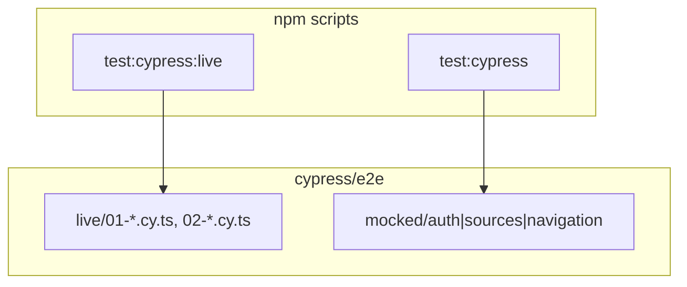
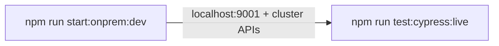

# Cypress live e2e migration (single `test:cypress:live`)

## Goals

- **One local gate:** [`test:cypress:live`](submodules/koku-ui/apps/koku-ui-onprem/package.json) runs all 8 live scenarios in a single `cypress run` (no `verify:onprem-nav`, no bash, no Playwright).
- **No new dependencies:** remove `playwright` from [`koku-ui-onprem/package.json`](submodules/koku-ui/apps/koku-ui-onprem/package.json); use existing Cypress ^15.15.0.
- **Better structure:** `live/` vs `mocked/` folders, page objects, thin numbered live spec files; AC-aligned `it()` titles.
- **Out of scope (per your opt-out):** `test:cypress:live` alias, separate `cypress.live.config.ts`, CI `throw` guard, broad refactors to [`commands.ts`](submodules/koku-ui/apps/koku-ui-onprem/cypress/support/commands.ts) beyond live-console guard + types.

## Target layout

```text
cypress/
  README.md
  cypress.config.ts
  e2e/
    live/
      01-app-loads.cy.ts
      02-host-iam-navigation.cy.ts
    mocked/
      auth/auth.cy.ts              # moved from e2e/auth/
      sources/integrations.cy.ts   # moved from e2e/sources/
      navigation/federatedModules.cy.ts
  support/
    pages/                         # new — live page objects
    commands.ts
    index.ts
    @types/Cypress.d.ts
```



## Move existing specs to `mocked/`

Use `git mv` (preserve history) from current paths:

| From | To |
|------|-----|
| [`cypress/e2e/auth/`](submodules/koku-ui/apps/koku-ui-onprem/cypress/e2e/auth/) | `cypress/e2e/mocked/auth/` |
| [`cypress/e2e/sources/`](submodules/koku-ui/apps/koku-ui-onprem/cypress/e2e/sources/) | `cypress/e2e/mocked/sources/` |
| [`cypress/e2e/navigation/`](submodules/koku-ui/apps/koku-ui-onprem/cypress/e2e/navigation/) | `cypress/e2e/mocked/navigation/` |

No logic changes required in moved specs (still use `cy.loadApiInterceptors()` in `beforeEach`).

Update [`cypress.config.ts`](submodules/koku-ui/apps/koku-ui-onprem/cypress/cypress.config.ts):

```ts
specPattern: 'cypress/e2e/mocked/**/*.cy.ts',
```

Default config then targets **mocked only**; live runs always pass an explicit `--spec` override.

## Preconditions (documented, not automated)



[`start:onprem:dev`](submodules/koku-ui/package.json) already runs `. scripts/setup-onprem-env.sh && npm run start:onprem` — docs will say **`oc login` + `npm run start:onprem:dev`** only (no redundant manual `source`).

## Live spec files (stable order)

Prefix filenames so Cypress runs **loads before nav**:

| File | Tests (`it` titles = scenario IDs) |
|------|-------------------------------------|
| [`cypress/e2e/live/01-app-loads.cy.ts`](submodules/koku-ui/apps/koku-ui-onprem/cypress/e2e/live/01-app-loads.cy.ts) | `rbac-plugin-manifest`, `iam-my-user-access-loads`, `cost-overview-loads` |
| [`cypress/e2e/live/02-host-iam-navigation.cy.ts`](submodules/koku-ui/apps/koku-ui-onprem/cypress/e2e/live/02-host-iam-navigation.cy.ts) | `iam-sidebar-toggle`, `iam-to-overview`, `iam-to-settings`, `iam-to-optimizations`, `cost-to-iam-roundtrip` |

Port behavior from current Playwright sources:

- [`verify-app-loads.mjs`](submodules/koku-ui/apps/koku-ui-onprem/e2e/verify-app-loads.mjs) → `01-app-loads.cy.ts` (`cy.request` for manifest JSON)
- [`verify-onprem-nav.mjs`](submodules/koku-ui/apps/koku-ui-onprem/e2e/verify-onprem-nav.mjs) + [`helpers.mjs`](submodules/koku-ui/apps/koku-ui-onprem/e2e/helpers.mjs) → `02-host-iam-navigation.cy.ts` (sidebar timing, depth console guard)

Both files use top-level `describe(..., { testTimeout: 180_000 })` to mirror 180s/scenario Playwright deadline. Prefer assertion timeouts over fixed `cy.wait(3000)` where possible.

## Support layer (new, live-only usage)

```text
cypress/support/
  pages/
    iam.page.ts          # visitMyUserAccess(), toggleGlobalNavTwice()
    host-nav.page.ts     # clickOverview/Settings/Optimizations(), myUserAccessLink()
  commands.ts            # add setupLiveConsoleGuard() — fail on /maximum update depth/i
  @types/Cypress.d.ts    # declare new command
```

- Live specs call `beforeEach(() => cy.setupLiveConsoleGuard())` — **do not** call `loadApiInterceptors()`.
- Page objects centralize selectors from Playwright (`Global navigation`, `Overview`, `My User Access`, etc.).

Add [`cypress/README.md`](submodules/koku-ui/apps/koku-ui-onprem/cypress/README.md): `mocked/` vs `live/`, `test:cypress` vs `test:cypress:live`, `start:onprem:dev`, not CI.

## Scripts and config

| Script | Command |
|--------|---------|
| **`test:cypress:live`** | `cypress run --config-file ./cypress/cypress.config.ts --spec 'cypress/e2e/live/**/*.cy.ts'` |
| **`test:cypress`** | `cypress run --config-file ./cypress/cypress.config.ts` (uses config `specPattern` → `mocked/**` only) |
| **`test:cypress:open`** | `cypress open --config-file ./cypress/cypress.config.ts` (UI shows mocked by default; live visible under `e2e/live/`) |

**Remove** from [`koku-ui-onprem/package.json`](submodules/koku-ui/apps/koku-ui-onprem/package.json):

- `test:cypress:live:loads`, `test:cypress:live:nav`
- Playwright `devDependencies` entry

**Remove** from [`koku-ui/package.json`](submodules/koku-ui/package.json):

- `verify:onprem-nav` script

Keep root `test:cypress:live` → `npm run -w @koku-ui/koku-ui-onprem test:cypress:live`.

Do **not** attach `test:cypress:live` to workspace `test`, `build:onprem`, or `verify:onprem` chains.

Run `npm install` in `submodules/koku-ui` after removing Playwright to refresh lockfile.

## Delete Playwright tree

Remove entire [`apps/koku-ui-onprem/e2e/`](submodules/koku-ui/apps/koku-ui-onprem/e2e/) (`.mjs`, `.sh`, README).

## Documentation updates

| Location | Change |
|----------|--------|
| [`apps/koku-ui-onprem/README.md`](submodules/koku-ui/apps/koku-ui-onprem/README.md) | `cypress/e2e/live/` + `mocked/`; drop `verify:onprem-nav`; `start:onprem:dev` only |
| [`pipelines/.../ACCEPTANCE_CRITERIA.md`](pipelines/rpi/v1/stages/40-verify/output/flpath-4164/ACCEPTANCE_CRITERIA.md) | Cypress live path; single command; remove nav row; fix recommended flow |
| [`wiki/topics/onprem-playwright-e2e.md`](wiki/topics/onprem-playwright-e2e.md) | Revise to Cypress (`live/` vs `mocked/`); drop `verify:onprem-nav` |
| [`wiki/index.md`](wiki/index.md), [`wiki/entities/flpath-4164-rbac-mfe-poc.md`](wiki/entities/flpath-4164-rbac-mfe-poc.md), [`wiki/log.md`](wiki/log.md) | Align paths and single gate |

Historical pipeline docs (`PLAN.md`, `IMPLEMENTATION_LOG.md`, `VERIFICATION.md`) — optional one-line “superseded by Cypress live” only if you want; not required for behavior.

## Verification (manual)

1. `npm ci` in `submodules/koku-ui`
2. Terminal A: `npm run start:onprem:dev`
3. Terminal B: `npm run test:cypress:live` → expect **8 passing** tests in order (01 then 02)
4. `npm run test:cypress` → runs **mocked** specs only (no live)
5. `rg playwright apps/koku-ui-onprem` → no runtime usage

## Commits (suggested)

1. **koku-ui submodule:** feat — move mocked specs, add live Cypress, remove Playwright/`e2e/`
2. **workspace:** docs/wiki/pipeline AC + submodule gitlink
