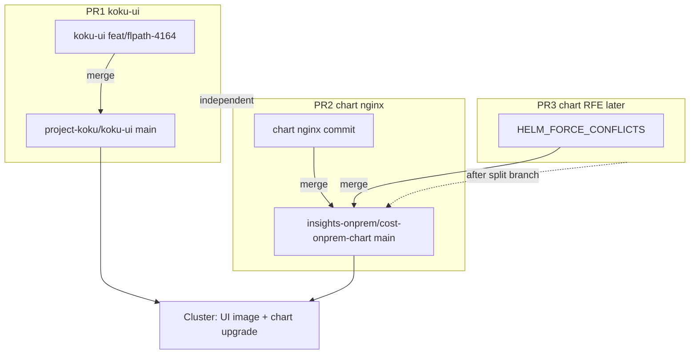

# FLPATH-4164 PR submission plan

## Current state

| Repo | Branch | Commit(s) | Fork pushed | PR open |
|------|--------|-----------|-------------|---------|
| [submodules/koku-ui](submodules/koku-ui) | `feat/flpath-4164` | `937935d13` (squashed POC) | Yes → `jkilzi/koku-ui` | No |
| [submodules/cost-onprem-chart](submodules/cost-onprem-chart) | `feat/flpath-4164-ui-rbac-nginx` | `90a7e30c` + `6f6dd775` | Yes → `jkilzi/cost-onprem-chart` | No |
| [cost-mgmt-onprem-workspace](.) | `main` | Submodule pin at `937935d13` | Synced with `origin/main` | N/A (tracking repo) |

Evidence and acceptance criteria live on [wiki/entities/flpath-4164-rbac-mfe-poc.md](wiki/entities/flpath-4164-rbac-mfe-poc.md). Jira draft ready in `.cursor/tmp/flpath-4164-jira-comment.txt` (ignored by git).



---

## Step 1 — Pre-flight verification (koku-ui)

Run from [submodules/koku-ui](submodules/koku-ui) on `feat/flpath-4164` before opening the PR:

```bash
npm ci
npm run build:onprem
npm run verify:onprem
# Optional local gate (requires oc + cluster via setup-onprem-env.sh):
npm run start:onprem:dev   # separate terminal
npm run test:cypress:live  # 21/21 expected
```

**Record results** on [wiki/entities/flpath-4164-rbac-mfe-poc.md](wiki/entities/flpath-4164-rbac-mfe-poc.md) implementation status (date + pass/fail).

**CI expectation:** PR to `project-koku/koku-ui` **base `main`** will trigger existing workflows on onprem paths ([`.github/workflows/ci.yml`](submodules/koku-ui/.github/workflows/ci.yml), [`cypress.yml`](submodules/koku-ui/.github/workflows/cypress.yml)). Live Cypress (`test:cypress:live`) is **local-only** — call this out in the PR test plan.

---

## Step 2 — Open PR1: koku-ui (primary POC)

**Create:** `gh pr create` from `submodules/koku-ui`

| Field | Value |
|-------|--------|
| **Head** | `jkilzi:feat/flpath-4164` |
| **Base** | `project-koku/main` |
| **Jira** | FLPATH-4164 |

**Suggested title:** `feat(onprem): federate RBAC IAM MFE for FLPATH-4164`

**Summary bullets for PR body:**
- Adds `apps/rbac-ui-onprem` remote (`insightsRbac`, `/rbac/`, `./Iam`) + `onprem-cloud-deps` shims
- Host: `/iam/*` routes, IAM sidebar nav, static `/rbac/` assets, dev proxy to `/api/rbac/`
- Fixes cluster nav freeze (stable `useChrome`, PF skeleton shims, lazy `./Iam`)
- Live Cypress specs `01`–`04` (21 tests) — local gate only, not CI
- **Companion chart PR required for production static assets** (see PR2)

**Test plan checklist:**
- [ ] `npm run build:onprem`
- [ ] `npm run verify:onprem`
- [ ] CI green (build-onprem + integration Cypress)
- [ ] Manual: IAM nav Overview → MUA → Users → Roles → Groups; no freeze
- [ ] Cluster (post-merge + chart PR): `/rbac/plugin-manifest.json` 200 in UI pod

**Reviewers / links:** Link FLPATH-4164, FLPATH-3424 parent, closed FLPATH-4180 research. Note FLPATH-4152 (maintainer sync) as follow-up after merge.

---

## Step 3 — Split chart branch and open PR2 (nginx only)

Current branch [`feat/flpath-4164-ui-rbac-nginx`](submodules/cost-onprem-chart) stacks two commits. Per your choice, **PR2 is nginx-only**; the SSA commit becomes a separate RFE PR.

**Branch prep (in `submodules/cost-onprem-chart`):**

```bash
git checkout main && git pull origin main
git checkout -b feat/flpath-4164-ui-rbac-nginx-pr
git cherry-pick 90a7e30c   # fix(ui): serve RBAC MFE assets under /rbac/
git push -u origin feat/flpath-4164-ui-rbac-nginx-pr
```

**Create:** PR to `insights-onprem/cost-onprem-chart` **base `main`**

| Field | Value |
|-------|--------|
| **Change** | [`cost-onprem/templates/ui/nginx-config.yaml`](submodules/cost-onprem-chart/cost-onprem/templates/ui/nginx-config.yaml) — `location /rbac/` |
| **Jira** | FLPATH-4164 (depends on FLPATH-4073 Envoy `/api/rbac/` route for API calls) |

**Summary:** Serves federated RBAC MFE static assets at `/rbac/` in the UI nginx sidecar. Required for cluster deployment of the koku-ui POC; dev proxy alone is insufficient in production.

**Test plan:**
- [ ] `helm template` / chart pytest if applicable
- [ ] In-pod: `curl http://127.0.0.1:8080/rbac/plugin-manifest.json` → 200 after UI image + chart upgrade

Cross-link PR1 and PR2 in both descriptions; either can merge first, but **full cluster POC needs both** + published chart version (currently `0.2.20-rc5` local only per entity page).

---

## Step 4 — Defer PR3: Helm SSA RFE (separate submission)

**Do not include** `6f6dd775` in the FLPATH-4164 chart PR.

### Rationale (from workspace logs)

During FLPATH-4164 cluster iteration ([wiki/log.md](wiki/log.md) 2026-05-22):

1. Built UI image `quay.io/jkilzi/koku-ui-onprem:flpath-4164-rc22`
2. **`helm upgrade` failed with server-side apply (SSA) field-ownership conflicts** on `cost-onprem-ui`
3. **Workaround:** deployed via `oc set image deployment/cost-onprem-ui …` (bypasses Helm values)
4. Subsequent Helm upgrades cannot reclaim fields patched outside Helm unless `--force-conflicts` is used

The commit adds opt-in `HELM_FORCE_CONFLICTS=true` to [`scripts/install-helm-chart.sh`](submodules/cost-onprem-chart/scripts/install-helm-chart.sh). [`rollout-ui-image.sh`](.cursor/skills/koku-ui-onprem-cluster-image/scripts/rollout-ui-image.sh) already sets this for skill-driven rollouts; the RFE generalizes it for manual installs.

**When ready (separate PR):**

```bash
git checkout main && git pull
git checkout -b feat/install-helm-force-conflicts
git cherry-pick 6f6dd775
git push -u origin feat/install-helm-force-conflicts
```

**Suggested title:** `feat(install): opt-in HELM_FORCE_CONFLICTS for SSA upgrade conflicts`

**Frame as RFE**, not FLPATH-4164: improves operability after emergency `oc set image` / kubectl patches on chart-managed Deployments. Cite rc22 rollout evidence; no nginx or RBAC scope.

---

## Step 5 — Jira handoff (approval required)

Draft in `.cursor/tmp/flpath-4164-jira-comment.txt` covers screencast, verification (21/21 Cypress, build/verify pass), and PR links.

Per [jira-slack-approval rule](.cursor/rules/jira-slack-approval.mdc):

1. Show final comment text + PR URLs in chat
2. Wait for explicit approval
3. Post to FLPATH-4164 via `jira issue comment add`

Also paste **minimum implementer block** per [wiki/workspace/jira-handoff-without-public-repo.md](wiki/workspace/jira-handoff-without-public-repo.md) (no raw workspace paths; link GitHub PRs once open).

---

## Step 6 — Post-PR housekeeping

- Update [wiki/entities/flpath-4164-rbac-mfe-poc.md](wiki/entities/flpath-4164-rbac-mfe-poc.md): PR URLs, CI status, chart PR dependency
- Append [wiki/log.md](wiki/log.md): `## [YYYY-MM-DD] update | FLPATH-4164 PRs opened`
- **Parent workspace:** only bump submodule gitlink again if koku-ui HEAD changes after review feedback; currently pinned correctly
- **Cluster demo:** keep `flpath-4164-rc22` tag documented; rebuild only if review requests code changes
- **FLPATH-4152:** track maintainer sync / upstream alignment as post-merge follow-up

---

## Out of scope for this submission

- PR for `cost-mgmt-onprem-workspace` (already synced; wiki is internal tracking)
- `insights-rbac-ui` upstream edits (POC constraint)
- Merging live Cypress into CI (documented as local gate)
- Publishing chart `0.2.20-rc5+` to Helm repo (separate release process)
