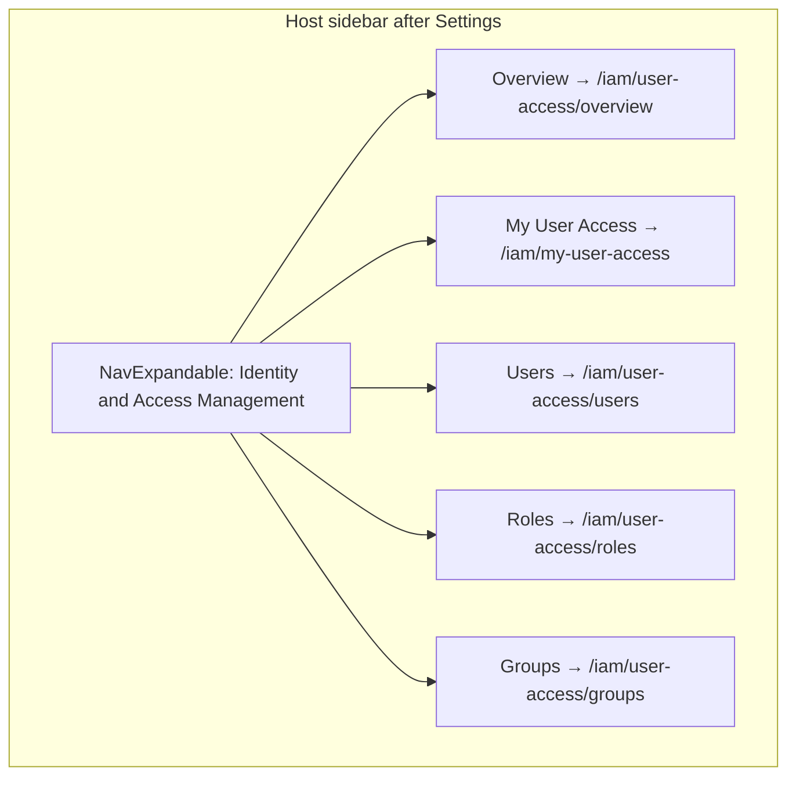

# IAM host nav — Stefan expandable parity (FLPATH-4164)

## Hard constraint — no upstream RBAC UI edits

**Under no circumstances may this work change code under [`submodules/insights-rbac-ui/`](submodules/insights-rbac-ui/).** That submodule is **read-only** for this stream (research, path reference, Storybook patterns only).

All implementation stays in **`submodules/koku-ui/`** on branch `feat/flpath-4164`:

| Allowed | Forbidden |
|---------|-----------|
| [`apps/koku-ui-onprem/`](submodules/koku-ui/apps/koku-ui-onprem/) — host nav (`AppLayout`, `onpremRemotes`) | Any file under `submodules/insights-rbac-ui/` |
| [`apps/rbac-ui-onprem/`](submodules/koku-ui/apps/rbac-ui-onprem/) — webpack, shims, `onprem-entry` only | Forking or patching upstream `src/` in the submodule |
| [`libs/onprem-cloud-deps/`](submodules/koku-ui/libs/onprem-cloud-deps/) — chrome/RBAC/Unleash stubs | Bumping upstream behavior by editing pinned source in the submodule |

Upstream UI is consumed **only** via the git-pinned npm package `insights-rbac-frontend` (from `apps/rbac-ui-onprem/rbac-ui.version.json`). Nav parity is achieved entirely in the **host shell**; federated routes already exist upstream and need no upstream changes.

## Target UX (corrected)



- **Component:** [`NavExpandable`](https://www.patternfly.org/components/navigation) — same visual weight as Overview / Settings (not [`NavGroup`](submodules/koku-ui/apps/koku-ui-onprem/src/components/App/AppLayout.tsx) with bold section title).
- **Placement:** After the Settings row in [`routes`](submodules/koku-ui/apps/koku-ui-onprem/src/components/App/AppLayout.tsx) (line 66–68).
- **IAM Overview** is `/iam/user-access/overview` — distinct from Cost **Overview** (`/openshift/cost-management`).

Upstream V1 routes for all five children already exist in the pinned package (`insights-rbac-frontend` → `pathnames.ts` under `node_modules`); direct URLs work today. The gap is **discoverable host navigation only** — no upstream route or layout work required.

## Current vs target

| Aspect | Today | Target |
|--------|--------|--------|
| Container | `NavGroup title="Identity and access"` | `NavExpandable title="Identity and Access Management"` |
| Children | 1 (My User Access) | 5, ordered: Overview, My User Access, Users, Roles, Groups |
| Enter IAM | `<a href>` for MUA only | Same pattern for all IAM targets |
| Leave IAM | `window.location.assign` for cost nav | Unchanged |
| AC | "Full IAM nav" **out of scope** | In scope with Cypress coverage |

## Implementation

### 1. Centralize IAM nav paths — [`onpremRemotes.ts`](submodules/koku-ui/apps/koku-ui-onprem/src/onpremRemotes.ts)

Add constants aligned with upstream V1 pathnames (relative to `/iam` basename):

```ts
export const RBAC_IAM_OVERVIEW_PATH = '/user-access/overview';
export const RBAC_IAM_USERS_PATH = '/user-access/users';
export const RBAC_IAM_ROLES_PATH = '/user-access/roles';
export const RBAC_IAM_GROUPS_PATH = '/user-access/groups';
// RBAC_MY_USER_ACCESS_PATH already exists: '/my-user-access'

export const IAM_NAV_ITEMS = [
  { label: 'Overview', segment: RBAC_IAM_OVERVIEW_PATH },
  { label: 'My User Access', segment: RBAC_MY_USER_ACCESS_PATH },
  { label: 'Users', segment: RBAC_IAM_USERS_PATH },
  { label: 'Roles', segment: RBAC_IAM_ROLES_PATH },
  { label: 'Groups', segment: RBAC_IAM_GROUPS_PATH },
] as const;

export const toIamHostNavPath = (segment: string, iamBasename: boolean): string =>
  iamBasename ? segment : `${RBAC_IAM_ROUTE_PREFIX}${segment}`;
```

### 2. Host sidebar — [`AppLayout.tsx`](submodules/koku-ui/apps/koku-ui-onprem/src/components/App/AppLayout.tsx)

- **Imports:** Replace `NavGroup` with `NavExpandable` from `@patternfly/react-core`.
- **Remove** lines 199–203 (`NavGroup` + single child).
- **Add** after `routes.map(...)`:

```tsx
const onIamSection = isIamRoute(location.pathname, iamBasename);

<NavExpandable
  title="Identity and Access Management"
  isExpanded={onIamSection}
  isActive={onIamSection}
>
  {IAM_NAV_ITEMS.map(({ label, segment }) => (
    <NavItem
      key={segment}
      to={toIamHostNavPath(segment, iamBasename)}
      onLeaveIam={handleLeaveIam}
      iamBasename={iamBasename}
    >
      {label}
    </NavItem>
  ))}
</NavExpandable>
```

- **Reuse existing `NavItem`** wrapper — it already handles:
  - **Enter IAM from cost:** `<a href="/iam/...">` (full navigation, avoids Phase 8 router races).
  - **Leave IAM to cost:** `<button>` + `handleLeaveIam`.
  - **Within IAM (basename `/iam`):** `<Link to={relative segment}>`.
- **Active highlighting:** Existing `isCostNavActive` works for absolute IAM paths on the cost shell; verify each child highlights on nested routes (e.g. `/iam/user-access/users/detail/...`). If Overview wildcard routes miss active state, add a small `isIamNavActive(pathname, segment)` helper (prefix match under `/iam`).

No changes to [`ScalprumComponent`](submodules/koku-ui/apps/koku-ui-onprem/src/components/App/AppLayout.tsx) routes or [`onprem-entry.tsx`](submodules/koku-ui/apps/rbac-ui-onprem/src/onprem-entry.tsx).

### 3. Permission-gated nav (deferred)

Upstream [`V1Routing`](submodules/koku-ui/node_modules/insights-rbac-frontend/src/v1/Routing.tsx) guards pages with `rbac:*:read`, `rbac:principal:read`, etc. For this pass:

- **Show all five links** (POC “full surface” per [`PLAN.md`](pipelines/rpi/v1/stages/20-plan/output/flpath-4164/PLAN.md) until FLPATH-4121).
- Dev stub already treats org admin as allowed ([`RBACHook.ts`](submodules/koku-ui/libs/onprem-cloud-deps/src/frontend-components-utilities/RBACHook.ts)).

Optional follow-up: hide nav items when `/api/rbac/v1/access/` denies permission (not blocking Stefan structure).

### 4. Cypress live tests — [`apps/koku-ui-onprem/cypress/`](submodules/koku-ui/apps/koku-ui-onprem/cypress/)

**Page objects**

- [`host-nav.page.ts`](submodules/koku-ui/apps/koku-ui-onprem/cypress/support/pages/host-nav.page.ts): helpers to expand **Identity and Access Management** (if collapsed) and click IAM child by label; update `clickMyUserAccessLink` to use expandable + child link.
- [`iam.page.ts`](submodules/koku-ui/apps/koku-ui-onprem/cypress/support/pages/iam.page.ts): `visitUsers()`, `visitGroups()`, `visitRoles()`, `visitIamOverview()` with heading assertions (`Users`, `Groups`, `Roles`, or IAM overview title).

**New spec** (recommended): `cypress/e2e/live/03-iam-sidebar-navigation.cy.ts`

| Test | Action | Assert |
|------|--------|--------|
| `iam-nav-users` | From cost, expand IAM → Users | URL `/iam/user-access/users`, `h1` Users |
| `iam-nav-groups` | … → Groups | URL + heading |
| `iam-nav-roles` | … → Roles | URL + heading |
| `iam-nav-overview` | … → Overview | URL `/iam/user-access/overview` |
| `iam-nav-mua` | … → My User Access | URL `/iam/my-user-access`, MUA heading |
| (each) | `cy.assertNoDepthConsoleErrors()` in `afterEach` | Same guard as existing live specs |

Keep existing [`02-host-iam-navigation.cy.ts`](submodules/koku-ui/apps/koku-ui-onprem/cypress/e2e/live/02-host-iam-navigation.cy.ts) cost↔IAM roundtrip tests; they use **Cost** Overview button, not IAM Overview — no conflict.

**Run gate:** `npm run start:onprem:dev` → `npm run test:cypress:live` (expect **8 + N** passing).

### 5. Pipeline / wiki docs

- [`ACCEPTANCE_CRITERIA.md`](pipelines/rpi/v1/stages/40-verify/output/flpath-4164/ACCEPTANCE_CRITERIA.md): Remove "Full IAM nav" from **Out of scope**; add **Host IAM navigation** checklist matching Stefan order + expandable label; add Cypress rows for `03-iam-sidebar-navigation.cy.ts`.
- [`PLAN.md`](pipelines/rpi/v1/stages/20-plan/output/flpath-4164/PLAN.md): Update **UX vision** bullet (expandable IAM block, child order); mark Phase 8 deferred item "Full IAM nav parity" as **in progress / done** when implemented.
- [`wiki/entities/flpath-4164-rbac-mfe-poc.md`](wiki/entities/flpath-4164-rbac-mfe-poc.md): One-line nav parity note + link to AC.

### 6. Out of scope for this plan

- **CSS / table styling** (shim-related drift) — separate pass after nav is clickable.
- **Breadcrumbs / document title** — SaaS chrome concern; not required for expandable parity.
- **Cluster image rebuild** — local + AC/Cypress first; note in `IMPLEMENTATION_LOG.md` when tagging rc18+.
- **Any change under `submodules/insights-rbac-ui/`** — absolute prohibition (see Hard constraint above).

## Verification

```bash
cd submodules/koku-ui
npm run build:onprem && npm run verify:onprem
npm run start:onprem:dev   # separate terminal
npm run test:cypress:live
```

Manual spot-check: expandable sits below Settings, typography matches siblings, expands on any `/iam/*` URL, all five destinations render content.

## Risk notes

| Risk | Mitigation |
|------|------------|
| Two "Overview" labels in sidebar | Acceptable — different targets; Cypress uses distinct URLs |
| `NavExpandable` + custom `<li>` children | Use PF6 `NavExpandable` + existing host `NavItem` wrapper; reference upstream Storybook `LeftNavigation` for path order only (read-only, not copied into submodule) |
| IAM Overview requires `rbac:*:read` | Org-admin dev stub grants access; cluster manual check if non-admin |
