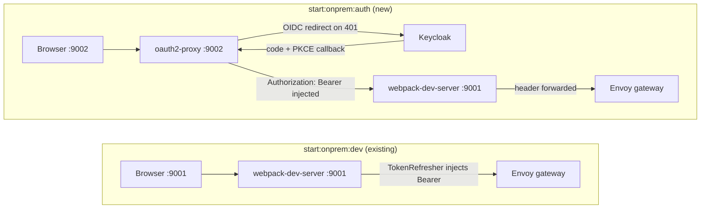

# On-prem Auth Dev Mode (oauth2-proxy)

## Goal

Enable two coexisting dev modes:

| Script | Auth | Port | Use for |
|---|---|---|---|
| `start:onprem:dev` | `TokenRefresher` (client_credentials, headless) | 9001 | Daily dev, API testing |
| `start:onprem:auth` | oauth2-proxy (OIDC code+PKCE, real sessions) | 9002 | Login screen, logout, session expiry |

## Architecture



In the auth mode, webpack's dev server is unchanged on port 9001. oauth2-proxy sits in front on port 9002, exactly mirroring the cluster's sidecar configuration.

## Files to change

### 1. New: [`scripts/start-onprem-auth.sh`](submodules/koku-ui/scripts/start-onprem-auth.sh)

Shell script sourced by `start:onprem:auth`. Steps:
- Sources `scripts/setup-onprem-env.sh` to get `API_PROXY_URL`, `KEYCLOAK_TOKEN_URL`, `KEYCLOAK_CLIENT_ID`, `KEYCLOAK_CLIENT_SECRET`
- Derives issuer URL: strip `/token` suffix from `KEYCLOAK_TOKEN_URL`
- Reads `cost-management-ui` client credentials from cluster secret `keycloak-client-secret-cost-management-ui` in `keycloak` ns
- Downloads the Keycloak CA cert from cluster secret `keycloak-ca-cert` in `cost-onprem` ns to a temp file (needed for `--provider-ca-file`)
- Generates a random 32-byte base64 cookie secret
- Starts `npm run start:onprem` with `OAUTH2_PROXY_MODE=true` in the background (no `KEYCLOAK_CLIENT_SECRET` exported, so `TokenRefresher` is skipped)
- Waits for `:9001` to be ready (`curl -sf http://localhost:9001/ --retry 30 --retry-delay 2`)
- Starts oauth2-proxy on `:9002` mirroring the cluster flags:

```
oauth2-proxy \
  --http-address=localhost:9002 \
  --https-address= \
  --provider=keycloak-oidc \
  --oidc-issuer-url=$ISSUER_URL \
  --client-id=cost-management-ui \
  --client-secret=$UI_CLIENT_SECRET \
  --redirect-url=http://localhost:9002/oauth2/callback \
  --upstream=http://localhost:9001 \
  --cookie-secret=$COOKIE_SECRET \
  --cookie-secure=false \
  --skip-provider-button \
  --skip-auth-preflight \
  --pass-authorization-header \
  --set-xauthrequest \
  --code-challenge-method=S256 \
  --email-domain=* \
  --provider-ca-file=$KC_CA_CERT_FILE
```

### 2. Modify: [`apps/koku-ui-onprem/webpack.config.ts`](submodules/koku-ui/apps/koku-ui-onprem/webpack.config.ts)

Three targeted changes, all gated on `process.env.OAUTH2_PROXY_MODE === 'true'`:

**a) Skip auth validation and `TokenRefresher` when in proxy mode**

At line 46, extend the guard:

```ts
const isOauth2ProxyMode = process.env.OAUTH2_PROXY_MODE === 'true';

if (NODE_ENV !== 'production' && !process.env.CI) {
  if (!process.env.API_PROXY_URL) { throw ... }

  if (!isOauth2ProxyMode) {
    // existing hasKeycloak / TokenRefresher logic unchanged
  }
}
```

**b) `/api/me` reads real headers in proxy mode, falls back to dev defaults**

Replace lines 16-23:

```ts
setupMiddlewares = (middlewares, devServer) => {
  devServer.app?.get('/api/me', (req, res) => {
    const username = req.headers['x-auth-request-preferred-username'] ?? 'dev-user';
    const email   = req.headers['x-forwarded-email'] ?? 'dev@example.com';
    res.json({ username, email });
  });
  devServer.app?.get('/logout', (_, res) => {
    res.redirect('/oauth2/sign_out?rd=/oauth2/start');
  });
  return middlewares;
};
```

(The `/logout` handler works for both modes: in proxy mode `/oauth2/sign_out` is intercepted by oauth2-proxy on :9002; in headless mode it's a harmless redirect that navigates to a 404, which is acceptable since session expiry isn't being tested there.)

**c) Proxy becomes a plain pass-through in proxy mode** (no `proxyHeaders` override)

Lines 120-153: when `isOauth2ProxyMode`, always use the static proxy config (no `refresher`) and omit `proxyHeaders`:

```ts
proxy: [
  (refresher && !isOauth2ProxyMode)
    ? createDevServerProxy(refresher, { context: ['/api/cost-management/v1'], ... })
    : {
        context: ['/api/cost-management/v1'],
        target: process.env.API_PROXY_URL,
        changeOrigin: true,
        secure: false,
        pathRewrite: { '^/api/cost-management/v1': '' },
        // no headers override — oauth2-proxy already injected Authorization
      },
  ...
]
```

### 3. Modify: [`package.json`](submodules/koku-ui/package.json)

Add one script:

```json
"start:onprem:auth": ". scripts/start-onprem-auth.sh"
```

Add one entry in `scripts-info`:

```json
"start:onprem:auth": "Run onprem UI behind local oauth2-proxy (real login/logout, OIDC PKCE)"
```

## Prerequisites

- Podman **or** Docker with daemon running (one-time — documented in README; `oauth2-proxy` runs as a container, no binary install needed)
- `oc` logged in to the cluster (same as `start:onprem:dev`)

## What is NOT changed

- `start:onprem:dev` — unchanged, still uses `TokenRefresher`
- `App.tsx` / `chromeStub` — unchanged, correct for both modes
- `bootstrap.tsx` 401 interceptor — unchanged, works in both modes
- `setup-onprem-env.sh` — unchanged, reused as-is

