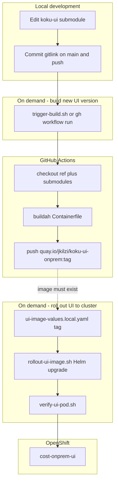

# On-prem UI cluster image skill + GHA

## Context


| Finding                                                                                                                                      | Implication                                                                    |
| -------------------------------------------------------------------------------------------------------------------------------------------- | ------------------------------------------------------------------------------ |
| `podman build --platform linux/amd64` on M3 Mac fails at `npm ci` with **ECDSA TLS `CERT_SIGNATURE_FAILURE`** (QEMU; downgrade did not help) | **Do not** use Mac amd64 builds for cluster tags                               |
| Native **arm64** Podman builds                                                                                                               | Optional Dockerfile smoke only — not cluster rollout                           |
| Upstream recipe: `[submodules/koku-ui/apps/koku-ui-onprem/Containerfile](submodules/koku-ui/apps/koku-ui-onprem/Containerfile)`              | GHA builds this file; context `submodules/koku-ui`                             |
| Chart UI image: `[ui.app.image](submodules/cost-onprem-chart/cost-onprem/values.yaml)`                                                       | Local overlay sets **repository + tag**                                        |
| Workspace repo                                                                                                                               | **Public**, already on `origin` — no publish step in this plan                 |
| Your choices                                                                                                                                 | Quay `quay.io/jkilzi/koku-ui-onprem:<tag>`; cluster update via **Helm values** |


## Separation of concerns

Two **independent**, **on-demand** actions (no automatic CI on push, tags, or branch names):


| User intent (skill / chat)                         | Where it runs                             | What it does                                                                                     |
| -------------------------------------------------- | ----------------------------------------- | ------------------------------------------------------------------------------------------------ |
| **Build a new UI version** (produce image on Quay) | GitHub Actions (`workflow_dispatch` only) | Checkout workspace at selected ref → build from **committed `koku-ui` submodule SHA** → push tag |
| **Roll out UI to cluster** (deploy existing tag)   | **Local Mac** (`oc` + Helm)               | `helm upgrade` with `ui-image-values.local.yaml` → verify pod                                    |


GHA never deploys to OpenShift. Rolling out does not trigger a build unless you explicitly run the build step first.

**Not branch-tied:** The workflow does not filter on `feat/flpath-4164` or any branch. It builds whatever `**submodules/koku-ui` gitlink** is recorded on the ref you dispatch (default: current `main` on GitHub). Local task branches are pinned by committing the submodule pointer on `main` (or passing an optional `ref` input for a specific workspace commit).




---

## Deliverables

### 1. Skill: `[.cursor/skills/koku-ui-onprem-cluster-image/SKILL.md](.cursor/skills/koku-ui-onprem-cluster-image/SKILL.md)`

Structure like `[cost-onprem-chart-install/SKILL.md](.cursor/skills/cost-onprem-chart-install/SKILL.md)`, with **two explicit procedures**:

#### A — Build new UI version (GHA only)


| Item               | Detail                                                                                                                                                                                              |
| ------------------ | --------------------------------------------------------------------------------------------------------------------------------------------------------------------------------------------------- |
| **Triggers**       | User asks to **build** / **produce** a new UI image or version; run `trigger-build.sh`                                                                                                              |
| **Prerequisites**  | `koku-ui` changes committed; workspace gitlink updated and **pushed to `origin`**; Quay secrets `QUAY_USERNAME` / `QUAY_PASSWORD` on GitHub repo                                                    |
| **Mac limitation** | No local `podman build --platform linux/amd64` for production tags ([podman#18271](https://github.com/containers/podman/issues/18271), [#18301](https://github.com/containers/podman/issues/18301)) |
| **Action**         | `gh workflow run build-koku-ui-onprem.yml -f image_tag=<tag>` [optional `-f ref=<sha                                                                                                                |
| **Output**         | Image `quay.io/jkilzi/koku-ui-onprem:<tag>` on Quay                                                                                                                                                 |


#### B — Roll out UI to cluster (local only)


| Item              | Detail                                                                                                                                                                          |
| ----------------- | ------------------------------------------------------------------------------------------------------------------------------------------------------------------------------- |
| **Triggers**      | User asks to **roll out** / **deploy** a UI version to the cluster                                                                                                              |
| **Prerequisites** | `oc login`; chart installed; image **already pushed** with matching tag; `ui-image-values.local.yaml` set; Quay **imagePullSecret** on cluster if needed (`<quay-pull-secret>`) |
| **Action**        | `rollout-ui-image.sh` → `VALUES_FILE=.../ui-image-values.local.yaml` + `[install-helm-chart.sh](submodules/cost-onprem-chart/scripts/install-helm-chart.sh)`                    |
| **Verify**        | `verify-ui-pod.sh` — `/rbac/plugin-manifest.json` → **200**                                                                                                                     |


**Scripts:**


| Script                                                                                                   | Flow                                                       |
| -------------------------------------------------------------------------------------------------------- | ---------------------------------------------------------- |
| `[scripts/trigger-build.sh](.cursor/skills/koku-ui-onprem-cluster-image/scripts/trigger-build.sh)`       | Build only: `workflow_dispatch`, poll run, print image ref |
| `[scripts/rollout-ui-image.sh](.cursor/skills/koku-ui-onprem-cluster-image/scripts/rollout-ui-image.sh)` | Rollout only: Helm upgrade from local values file          |
| `[scripts/verify-ui-pod.sh](.cursor/skills/koku-ui-onprem-cluster-image/scripts/verify-ui-pod.sh)`       | Post-rollout check                                         |


**References:**

- `[references/ui-image-values.example.yaml](.cursor/skills/koku-ui-onprem-cluster-image/references/ui-image-values.example.yaml)` — template with `quay.io/<your-org>/…` placeholders
- `[references/secrets.md](.cursor/skills/koku-ui-onprem-cluster-image/references/secrets.md)` — GitHub + Quay secret names (no values)

`**.gitignore`:**

```gitignore
.cursor/skills/koku-ui-onprem-cluster-image/references/ui-image-values.local.yaml
```

### 2. GHA workflow: `[.github/workflows/build-koku-ui-onprem.yml](.github/workflows/build-koku-ui-onprem.yml)`

**Build only. On demand only.**


| Item         | Design                                                                                                                                                                        |
| ------------ | ----------------------------------------------------------------------------------------------------------------------------------------------------------------------------- |
| `**on`**     | `**workflow_dispatch` only** — no `push`, no `pull_request`, no tag triggers                                                                                                  |
| **Inputs**   | `image_tag` (required); optional `ref` (workspace commit SHA or branch, default `main`) — selects which **gitlink** to build, not a `koku-ui` branch name inside the workflow |
| **Runner**   | `ubuntu-latest` (native amd64)                                                                                                                                                |
| **Checkout** | `actions/checkout@v4` at `ref: ${{ inputs.ref }}` with `submodules: recursive`                                                                                                |
| **Build**    | `redhat-actions/buildah-build@v2` — `containerfiles: submodules/koku-ui/apps/koku-ui-onprem/Containerfile`, `context: submodules/koku-ui`                                     |
| **Push**     | `redhat-actions/push-to-registry@v2` — `quay.io/jkilzi/koku-ui-onprem:${{ inputs.image_tag }}`                                                                                |
| **Secrets**  | `QUAY_USERNAME`, `QUAY_PASSWORD`                                                                                                                                              |


Public repo: default `GITHUB_TOKEN` suffices for checkout; submodules are public upstream URLs in `[.gitmodules](.gitmodules)`.

**npm note:** If `npm ci` hits **EBADENGINE** in UBI builder, document upstream fix first; SKILL-only fallback `npm install` — not default Containerfile change.

### 3. Helm values overlay (rollout only)

Local file (gitignored), e.g.:

```yaml
ui:
  app:
    image:
      repository: quay.io/jkilzi/koku-ui-onprem
      tag: "flpath-4164-rc22"
      pullPolicy: IfNotPresent
# global:
#   imagePullSecrets:
#     - name: <quay-pull-secret>
```

### 4. Harness + wiki


| File                                                                                     | Change                                                             |
| ---------------------------------------------------------------------------------------- | ------------------------------------------------------------------ |
| `[AGENTS.md](AGENTS.md)`                                                                 | Route cluster UI image → new skill; note two-step build vs rollout |
| `[wiki/topics/onprem-ui-cluster-image.md](wiki/topics/onprem-ui-cluster-image.md)`       | Build (GHA dispatch) vs rollout (local Helm); no branch coupling   |
| `[wiki/index.md](wiki/index.md)`                                                         | Index entry                                                        |
| `[wiki/entities/flpath-4164-rbac-mfe-poc.md](wiki/entities/flpath-4164-rbac-mfe-poc.md)` | Cluster deploy → skill; Helm-first                                 |
| `[wiki/log.md](wiki/log.md)`                                                             | Ingest on landing                                                  |


---

## Operator workflows

### Build path (when you want a new image on Quay)

1. Implement in `submodules/koku-ui` (any task branch); verify locally (`build:onprem`, `verify:onprem`, optional Cypress live).
2. Commit updated `**koku-ui` gitlink** on workspace `main`; **push** to `origin`.
3. Request **build new UI version** → `trigger-build.sh <tag>` (or GHA UI “Run workflow”).
4. Confirm tag on Quay before rollout.

### Rollout path (when you want the cluster to use that tag)

1. Set tag in `ui-image-values.local.yaml` (must match an image already on Quay).
2. Request **roll out UI to cluster** → `rollout-ui-image.sh`.
3. `verify-ui-pod.sh`; record tag on wiki entity if applicable.

Steps 3–4 of build and 1–3 of rollout are **independent** — you can rebuild without rolling out, or roll out an older tag without rebuilding.

---

## Verification


| Check         | Expectation                                              |
| ------------- | -------------------------------------------------------- |
| Workflow      | Only `workflow_dispatch` in Actions tab; no runs on push |
| Build smoke   | Dispatch with test tag; image appears on Quay            |
| Rollout smoke | Helm shows `ui.app.image` override; pod Running          |
| RBAC assets   | In-pod manifest **200**                                  |


---

## Out of scope

- Mac amd64 emulation / QEMU TLS fix
- GHA deploy to cluster (no `oc` / Helm in workflow)
- Auto-build on git push, tags, or named branches
- Submodule or upstream Containerfile changes (unless build fails on GHA)

