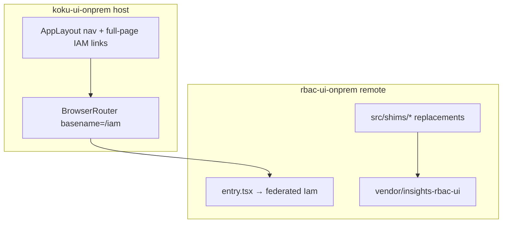
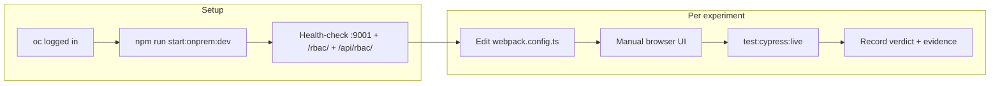

# Analyze rbac-ui-onprem shim necessity

## Context

On-prem IAM is a federated remote ([`apps/rbac-ui-onprem`](submodules/koku-ui/apps/rbac-ui-onprem/)) that wraps vendored upstream [`vendor/insights-rbac-ui`](submodules/koku-ui/vendor/insights-rbac-ui) without editing it. Webpack replaces upstream modules via aliases and `NormalModuleReplacementPlugin` in [`webpack.config.ts`](submodules/koku-ui/apps/rbac-ui-onprem/webpack.config.ts).

Documented rationale lives in [wiki/topics/rbac-ui-onprem-shims.md](wiki/topics/rbac-ui-onprem-shims.md) and the FLPATH-4164 nav diagnosis in [wiki/entities/flpath-4164-rbac-mfe-poc.md](wiki/entities/flpath-4164-rbac-mfe-poc.md#nav-diagnosis-2026-05-19-resolved).

**Out of scope for this analysis:** [`libs/onprem-cloud-deps`](submodules/koku-ui/libs/onprem-cloud-deps/) (useChrome, Unleash, AsyncComponent). Those are sibling shims wired in the same webpack config but solve SaaS-platform coupling—not the app-local `src/shims/` tree.



## Shim inventory (two root-cause families)

| Shim | Upstream target | Documented failure without shim |
|------|-----------------|--------------------------------|
| [`useAppLink.ts`](submodules/koku-ui/apps/rbac-ui-onprem/src/shims/insights-rbac/useAppLink.ts) | `shared/hooks/useAppLink.ts` | Double `/iam` prefix → redirect loop / tab freeze when host uses `basename="/iam"` |
| [`LoaderPlaceholders.tsx`](submodules/koku-ui/apps/rbac-ui-onprem/src/shims/insights-rbac/LoaderPlaceholders.tsx) | `ui-states/LoaderPlaceholders.tsx` | `AppPlaceholder` renders real `SkeletonTable` → ThBase infinite re-render |
| [`patternfly/SkeletonTable*.tsx`](submodules/koku-ui/apps/rbac-ui-onprem/src/shims/patternfly/) | PF component-groups subpaths | Same ThBase loop via dynamic/ESM imports |
| [`patternfly/component-groups.ts`](submodules/koku-ui/apps/rbac-ui-onprem/src/shims/patternfly/component-groups.ts) | `@patternfly/react-component-groups` barrel | Barrel pulls shared chunk **6658**; ~58 upstream files import from package root |
| [`placeholders.tsx`](submodules/koku-ui/apps/rbac-ui-onprem/src/shims/placeholders.tsx) | (local only) | Shared spinner/skeleton used by PF and loader shims |

**Coupled webpack policy:** `@patternfly/react-component-groups` is intentionally **not** in `sharedModules` (comment in webpack config). Any analysis of PF shims must test this flag together with the barrel/subpath replacements.

## Phase 1 — Baseline and static trace (read-only)

**Goal:** Confirm current wiring and whether upstream/PF drift has changed the original assumptions.

1. **Pin baseline** — Record gitlinks for `submodules/koku-ui`, `vendor/insights-rbac-ui`, and `@patternfly/react-component-groups` version from upstream `package.json` (^6.4.0 today).

2. **Map webpack replacements** — From [`webpack.config.ts`](submodules/koku-ui/apps/rbac-ui-onprem/webpack.config.ts), produce a table of:
   - alias keys
   - `NormalModuleReplacementPlugin` regexes
   - `insightsRbacModuleReplacements` entries

3. **Compare shim vs upstream for routing** — Diff [`shims/insights-rbac/useAppLink.ts`](submodules/koku-ui/apps/rbac-ui-onprem/src/shims/insights-rbac/useAppLink.ts) against [`vendor/.../useAppLink.ts`](submodules/koku-ui/vendor/insights-rbac-ui/src/shared/hooks/useAppLink.ts):
   - Upstream **prepends** `/iam` for relative paths and **returns unchanged** when path already starts with `/iam`.
   - Host sets `basename={getOnpremRouterBasename()}` → `/iam` ([`App.tsx`](submodules/koku-ui/apps/koku-ui-onprem/src/components/App/App.tsx), [`onpremRemotes.ts`](submodules/koku-ui/apps/koku-ui-onprem/src/onpremRemotes.ts)).
   - **Hypothesis:** shim still required unless host architecture or upstream contract changes (upstream has no on-prem/federated basename mode in docs).

4. **Trace SkeletonTable import graph** — In pinned upstream, enumerate:
   - Barrel imports: `from '@patternfly/react-component-groups'` (RolesTable, TableViewSkeleton, GroupsTable, etc.)
   - Subpath imports: `dist/dynamic/SkeletonTable` (LoaderPlaceholders, guards)
   - Confirm [`component-groups.ts`](submodules/koku-ui/apps/rbac-ui-onprem/src/shims/patternfly/component-groups.ts) re-exports real WarningModal/PageHeader/etc. from dynamic paths while stubbing only Skeleton* symbols.

5. **Identify host mitigations already in place** — These fixed *related* nav freeze causes but do **not** replace shims:
   - Full-page `<a href="/iam/...">` for Cost→IAM entry ([`AppLayout.tsx`](submodules/koku-ui/apps/koku-ui-onprem/src/components/App/AppLayout.tsx))
   - Stable `useChrome` singleton ([`onprem-cloud-deps`](submodules/koku-ui/libs/onprem-cloud-deps/src/frontend-components/useChrome.ts))
   - No nested Router in [`entry.tsx`](submodules/koku-ui/apps/rbac-ui-onprem/src/entry.tsx)
   - Host dropped PF from `sharedModules` (commit `82ebea300`) — may affect MF singleton behavior; note in findings.

**Deliverable:** Short “static assessment” section per shim: *likely still needed* / *uncertain* / *possibly obsolete*, with evidence links.

## Dev server and UI exercise protocol (required for every ablation)

All ablation experiments **must** run against the **cluster-backed local dev stack**, not production builds alone. This matches how FLPATH-4164 was originally verified and exercises real RBAC API traffic through the host proxy.

### Start and health-check

From `submodules/koku-ui` (requires `oc` logged into a cluster with cost-onprem):

```bash
git submodule update --init vendor/insights-rbac-ui
npm ci
npm run start:onprem:dev
```

[`start:onprem:dev`](submodules/koku-ui/package.json) runs [`scripts/setup-onprem-env.sh`](submodules/koku-ui/scripts/setup-onprem-env.sh) (sets `API_PROXY_URL`, Keycloak vars from the cluster), then [`start:onprem`](submodules/koku-ui/package.json) via `concurrently` — host + HCCM + ROS + Sources + **RBAC webpack watch** on **http://localhost:9001/**.

Before each experiment, confirm:

| Check | URL / command | Expected |
|-------|---------------|----------|
| Host up | http://localhost:9001/ | Cost Management shell loads |
| RBAC remote | http://localhost:9001/rbac/plugin-manifest.json | **200** JSON |
| RBAC API proxy | `/api/rbac/v1/status/` (via browser Network or curl through host) | **2xx** |

**Do not use** bare `npm run start:onprem` (missing proxy env) or `start:onprem:koku` (local Koku only) for these experiments.

### Per-experiment workflow

For each ablation variant:

1. Edit [`webpack.config.ts`](submodules/koku-ui/apps/rbac-ui-onprem/webpack.config.ts) (one shim category at a time).
2. **Restart or wait for RBAC webpack watch** to rebuild (watch is included in `start:onprem`; hard-restart dev server if a change does not hot-reload cleanly).
3. **Manual browser UI** — follow the experiment checklist below (Chrome DevTools open: Console + Network).
4. **Automated UI** — live Cypress against the same dev server (second terminal, dev server still running):
   ```bash
   npm run test:cypress:live -w @koku-ui/koku-ui-onprem
   ```
5. Record pass/fail, console errors (especially `Maximum update depth`), pathname observations, and screenshots if a freeze occurs.

Cypress live specs hit **http://localhost:9001** and use `setupLiveConsoleGuard` / `assertNoDepthConsoleErrors` ([`commands.ts`](submodules/koku-ui/apps/koku-ui-onprem/cypress/support/commands.ts)). They are the automated half of UI exercise; manual steps cover loading states Cypress may skip.

### Shared manual UI checklist (all experiments)

Use this baseline path on every variant (after dev-server health-check passes):

1. **Cost → IAM entry** — Overview → sidebar **My User Access** (full-page `/iam/...` navigation).
2. **IAM sidebar chain** — Overview → My User Access → Users → Roles → Groups; confirm pathname stays `/iam/...` (not `/iam/iam/...`).
3. **Host ↔ IAM exit** — IAM → Settings or Overview (Cost); sidebar toggle twice on IAM page.
4. **Console watch** — no tab freeze; no `Maximum update depth exceeded` in DevTools.

Experiment-specific steps below add loading-state and table coverage on top of this checklist.



## Phase 2 — Ablation experiments (temporary branch)

**Goal:** Empirically prove each shim category is or is not required. Work on a throwaway branch in `submodules/koku-ui` (e.g. `chore/shim-ablation-analysis`); do not merge until conclusions are documented.

Use **one category at a time** (not all at once) so failures are attributable. **Every experiment uses the dev server protocol above** — no experiment is complete without manual UI + Cypress on `start:onprem:dev`.

### Experiment A — Routing (`useAppLink`)

1. Disable shim: remove alias entries for `useAppLink` and its `NormalModuleReplacementPlugin` row.
2. Restart dev server; run shared manual UI checklist.
3. **Manual extras:** breadcrumb links on Users/Groups; watch catch-all redirect (`V1Routing` `path="*"`); confirm address bar never shows `/iam/iam/...`.
4. Run live Cypress (full suite or at minimum):
   - [`02-host-iam-navigation.cy.ts`](submodules/koku-ui/apps/koku-ui-onprem/cypress/e2e/live/02-host-iam-navigation.cy.ts) — sidebar toggle, Cost↔IAM roundtrip
   - [`03-iam-sidebar-navigation.cy.ts`](submodules/koku-ui/apps/koku-ui-onprem/cypress/e2e/live/03-iam-sidebar-navigation.cy.ts) — IAM nav chain + pathname assertions

**Pass without shim:** dev-server UI checklist green; Cypress depth guard clean; pathnames stay `/iam/...`; no tab freeze.

### Experiment B — Loader placeholders

1. Disable `LoaderPlaceholders` replacement only; restart dev server.
2. **Manual UI:** DevTools → Network → throttle **Slow 3G**; hard-refresh http://localhost:9001/iam/my-user-access and http://localhost:9001/iam/user-access/users — observe `AppPlaceholder` phase ([`IamV1.tsx`](submodules/koku-ui/vendor/insights-rbac-ui/src/v1/IamV1.tsx) `useUserData` gate).
3. Run shared manual checklist + live Cypress (`01-app-loads.cy.ts` + nav specs).

**Pass without shim:** loading placeholders render without freeze; no ThBase/depth console errors during initial IAM paint.

### Experiment C — PatternFly SkeletonTable (subpath aliases)

1. Disable the four `@patternfly/react-component-groups/dist/.../SkeletonTable*` aliases only (keep barrel shim); restart dev server.
2. **Manual UI:** visit each IAM page on dev server with Network throttling to surface skeleton states:
   - `/iam/user-access/overview`
   - `/iam/my-user-access`
   - `/iam/user-access/users`
   - `/iam/user-access/roles`
   - `/iam/user-access/groups`
3. Run shared manual checklist + live Cypress nav specs.

**Pass without shim:** table/guard loading skeletons do not freeze tab; console clean on all five routes.

### Experiment D — Barrel shim + sharedModules policy

Run as **2×2 matrix**. For **each cell**, restart dev server and run full UI protocol (manual checklist + Cypress):

| | Barrel shim ON | Barrel shim OFF |
|--|----------------|-----------------|
| `component-groups` **not** shared (current) | baseline | remove `NormalModuleReplacementPlugin` for package root |
| `component-groups` **added** to `sharedModules` | add to shared + keep barrel shim | add to shared + remove barrel shim |

**Manual UI priority:** http://localhost:9001/iam/my-user-access — [`RolesTable.tsx`](submodules/koku-ui/vendor/insights-rbac-ui/src/v1/features/myUserAccess/RolesTable.tsx) imports `{ SkeletonTableBody }` from barrel (original rc16 cluster failure). Also exercise Groups and Roles list pages where `GroupsTable` / `TableViewSkeleton` use barrel imports.

**Supplemental bundle evidence** (does not replace dev-server UI): after each matrix cell, optionally inspect production build output:
```bash
npm run build:onprem -w @koku-ui/rbac-ui-onprem
rg -l "6658|SkeletonTable|ThBase" apps/rbac-ui-onprem/dist/ || true
```

### Experiment E — Upstream pin sensitivity (optional)

On the baseline webpack config (all shims ON), bump `vendor/insights-rbac-ui` to latest `main`, restart dev server, and rerun Experiments A–D UI protocol. Records whether newer upstream reduces shim need without code changes.

## Phase 3 — Production image confirmation (optional follow-up)

Dev-server UI on `start:onprem:dev` is the **primary gate**. Phase 3 applies only when a shim category **passes** full dev-server UI ablation and you need to rule out production-only chunk/layout differences (original chunk **6658** symptom was seen on cluster nginx builds).

If proceeding:

1. Build/push a tagged image per [onprem-ui-cluster-image skill](.cursor/skills/koku-ui-onprem-cluster-image/SKILL.md).
2. Roll out to leased cluster; verify `/rbac/plugin-manifest.json` 200.
3. Manual Chrome behind SSO: IAM nav chain, sidebar toggle, MUA table load — watch for tab freeze (original cluster-only chunk 6658 symptom per [wiki log](wiki/log.md)).

Skip Phase 3 if dev-server UI ablation fails — shim is proven still necessary for the cluster-backed local stack.

## Phase 4 — Evaluate alternatives (if shims are still required)

For each shim category that **fails** ablation, document the smallest long-term fix (for FLPATH-4152 / maintainer sync), without implementing in this POC constraint:

| Category | Alternative | Tradeoff |
|----------|-------------|----------|
| `useAppLink` | Upstream federated prop/env to emit basename-relative paths | Requires upstream change; cleanest for Console + on-prem |
| `useAppLink` | Host removes `basename`, upstream keeps full `/iam` paths | Conflicts with single-router design in [`entry.tsx`](submodules/koku-ui/apps/rbac-ui-onprem/src/entry.tsx) comment |
| PF SkeletonTable | Upstream import only subpaths (no barrel) for Skeleton* | Large upstream diff; 58 import sites |
| PF SkeletonTable | Upgrade `@patternfly/react-component-groups` + retest MF sharing | May fix ThBase; must re-run 2×2 matrix |
| PF SkeletonTable | Share `component-groups` as singleton with version lock | Risk of host/remote PF mismatch |

## Decision criteria

| Outcome | Meaning | Action |
|---------|---------|--------|
| **Required** | Ablation reproduces freeze, depth error, or bad pathname | Keep shim; document repro steps |
| **Obsolete** | Dev-server UI ablation passes (manual checklist + live Cypress); optional Phase 3 image check | Plan removal PR with regression tests |
| **Partial** | Required in prod build but not dev, or only one route | Narrow shim scope (document exact import path) |
| **Upstream candidate** | Fix belongs in insights-rbac-ui | File upstream issue; keep shim until released |

## Artifacts to update after analysis

- [wiki/topics/rbac-ui-onprem-shims.md](wiki/topics/rbac-ui-onprem-shims.md) — per-shim verdict + ablation evidence
- [wiki/entities/flpath-4164-rbac-mfe-poc.md](wiki/entities/flpath-4164-rbac-mfe-poc.md) — acceptance / technical debt note
- [wiki/log.md](wiki/log.md) — one-line ingest entry

## Expected pre-read conclusion (hypothesis to validate)

Based on static analysis today, **all five shim surfaces are likely still necessary**:

- Upstream `useAppLink` still emits `/iam`-prefixed paths incompatible with host `basename`.
- Upstream `LoaderPlaceholders` still imports real `SkeletonTable`.
- Upstream still has widespread barrel imports from `@patternfly/react-component-groups`.
- Webpack still omits `component-groups` from `sharedModules`.

Ablation exists to **confirm or falsify** this—not to assume it.

## Prerequisites

```bash
cd submodules/koku-ui
git submodule update --init vendor/insights-rbac-ui
npm ci
oc login   # or confirm existing session — required for setup-onprem-env.sh
npm run start:onprem:dev   # keep running in background for all UI experiments
```

In a **second terminal** (dev server still up):

```bash
cd submodules/koku-ui
npm run test:cypress:live -w @koku-ui/koku-ui-onprem
```

Optional one-time cold start: `npm run build:onprem` before first `start:onprem:dev` if dist artifacts are missing; ongoing ablation relies on webpack watch inside `start:onprem`, not repeated full builds.

See [dev-server rule](.cursor/rules/koku-ui-onprem-dev-server.mdc) and [ui-verification-and-e2e](wiki/topics/ui-verification-and-e2e.md).
