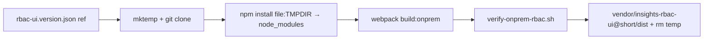

# Vendored RBAC remote build (short plan)

**Scope:** [`submodules/koku-ui`](submodules/koku-ui) (FLPATH-4164 follow-on). **Goal:** `fetch @ ref → rbac-ui-onprem webpack → commit vendor dist` so isolated/Konflux UI builds never resolve `github:RedHatInsights/insights-rbac-ui#…`.

## Target layout

```text
apps/rbac-ui-onprem/
  rbac-ui.version.json          # full ref + active vendorDir
  vendor/
    insights-rbac-ui@b4ca374/
      rbac-ui.build.json        # ref, builtAt, wrapper SHA, manifest fields
      dist/                     # plugin-manifest.json, plugin-entry.js, *Iam.bundle*.js, locales/
```

- **Vendor dir name:** `insights-rbac-ui@<short>` where short = first 7 chars of [`rbac-ui.version.json`](submodules/koku-ui/apps/rbac-ui-onprem/rbac-ui.version.json) `ref` (e.g. `insights-rbac-ui@b4ca374`).
- On bump: add new `vendor/insights-rbac-ui@<short>/`, update `vendorDir` in version file, remove previous vendor dir (one active pin at a time unless you explicitly want retention).

## Upstream install — where and when (explicit)

**Package name stays `insights-rbac-frontend`** (upstream [`package.json`](submodules/insights-rbac-ui/package.json) name). Webpack lines 17–18 keep using `require.resolve('insights-rbac-frontend/package.json')` → hoisted [`koku-ui/node_modules/insights-rbac-frontend`](submodules/koku-ui/node_modules/insights-rbac-frontend).

| When | Install upstream? | Where source lives | Where webpack resolves |
|------|-------------------|--------------------|-------------------------|
| **Vendor / rebuild** (`vendor:rbac-onprem`) | Yes | OS temp dir via `mktemp -d` (below) | `node_modules/insights-rbac-frontend` → symlink to temp clone |
| **Konflux / Containerfile / `build:onprem` (default)** | No | N/A | N/A — use committed `vendor/insights-rbac-ui@*/dist/` only |
| **Local dev (serve only)** | No | N/A | Host static path → vendor `dist/` |

### Vendor-build source location (OS temp — not in repo)

Use a disposable directory outside the monorepo (no new `.gitignore` entries):

```bash
RBAC_SRC_TMP="$(mktemp -d "${TMPDIR:-/tmp}/insights-rbac-ui-vendor.XXXXXX")"
trap 'rm -rf "$RBAC_SRC_TMP"' EXIT
```

1. `vendor-rbac-onprem.sh` creates `RBAC_SRC_TMP`, then `git clone` (shallow) or `git archive` `RedHatInsights/insights-rbac-ui` at `rbac-ui.version.json` → `ref` into that path.
   - **Optional shortcut:** if env `RBAC_SRC` is set to an existing clone (e.g. workspace [`submodules/insights-rbac-ui`](submodules/insights-rbac-ui)) at the same SHA, use it instead of cloning (skip `mktemp` cleanup for that path).
2. From **koku-ui root**, install without GitHub URL (absolute path to temp dir):
   ```bash
   npm install "file:${RBAC_SRC_TMP}" -w @koku-ui/rbac-ui-onprem --save-dev
   ```
   (Script may use `--no-save` + restore `package.json` afterward; committed `package.json` has **no** `insights-rbac-frontend` entry.)
3. npm places **`insights-rbac-frontend`** in root `node_modules/` (workspace hoist), linking to `$RBAC_SRC_TMP`.
4. Run `npm run build:onprem -w @koku-ui/rbac-ui-onprem` — webpack config unchanged.
5. Move `apps/rbac-ui-onprem/dist/` → `vendor/insights-rbac-ui@<short>/dist/`, write `rbac-ui.build.json`, `npm uninstall insights-rbac-frontend -w @koku-ui/rbac-ui-onprem` (or restore lockfile); `trap` removes temp dir on exit.

**Committed tree:** only `vendor/insights-rbac-ui@<short>/` (dist + metadata). Upstream source never lands under `apps/rbac-ui-onprem/vendor/` except the versioned `dist/` output.

## Pipeline (maintainer / online CI)



1. **Script** [`scripts/vendor-rbac-onprem.sh`](submodules/koku-ui/scripts/vendor-rbac-onprem.sh) (new): steps in **Upstream install** above; existing [`webpack.config.ts`](submodules/koku-ui/apps/rbac-ui-onprem/webpack.config.ts) unchanged.

2. **npm script:** `vendor:rbac-onprem` at koku-ui root calling the script.

## Consumer path (Konflux / Containerfile / daily build)

Update [`apps/koku-ui-onprem/Containerfile`](submodules/koku-ui/apps/koku-ui-onprem/Containerfile):

- `COPY` active `apps/rbac-ui-onprem/vendor/insights-rbac-ui@*/dist` → `./rbac`.
- **Drop** `npm run build:onprem --workspace=@koku-ui/rbac-ui-onprem` from image build.
- **Remove** `insights-rbac-frontend` `github:…` from [`apps/rbac-ui-onprem/package.json`](submodules/koku-ui/apps/rbac-ui-onprem/package.json) and regenerate lockfile so `npm ci` is hermetic.

## Root `build:onprem` / dev

- [`package.json`](submodules/koku-ui/package.json) `build:onprem`: skip `@koku-ui/rbac-ui-onprem` webpack when active vendor `dist/` exists; other remotes + host build unchanged.
- **Local dev** (`start:onprem`): serve RBAC static from active vendor `dist/` (adjust [`koku-ui-onprem/webpack.config.ts`](submodules/koku-ui/apps/koku-ui-onprem/webpack.config.ts) static `directory` or copy vendor → `dist/` via small prestart script).
- **Optional dev rebuild:** `vendor:rbac-onprem` when changing shims or bumping ref; document in README.

## Verification

Extend [`scripts/verify-onprem-rbac.sh`](submodules/koku-ui/scripts/verify-onprem-rbac.sh):

- **Dist-only mode** (default in CI/image): assert `vendorDir/dist/plugin-manifest.json` (`insightsRbac`, `/rbac/`, `Iam` bundle); skip `node_modules/insights-rbac-frontend` checks.
- **`--require-entry-only`:** only when running vendor script before compile.

Wire `verify:onprem` to dist-only when vendor present. Add CI check: `vendorDir` ref matches `rbac-ui.version.json` and `rbac-ui.build.json`.

## Gitignore

- Commit `apps/rbac-ui-onprem/vendor/insights-rbac-ui@*/**` only.
- **No** in-repo temp clone path — upstream checkout lives under OS `$TMPDIR` (`mktemp -d`); existing [`.gitignore`](submodules/koku-ui/.gitignore) unchanged for this workflow.
- Global [`dist/`](submodules/koku-ui/.gitignore) ignore stays; committed artifacts live under `vendor/.../dist/`, not `apps/rbac-ui-onprem/dist/`.

## Docs

- Wiki topic (new or extend [rbac-ui-onprem-shims.md](wiki/topics/rbac-ui-onprem-shims.md)): bump workflow + Konflux note.
- [FLPATH-4164 entity](wiki/entities/flpath-4164-rbac-mfe-poc.md): dependency model change (no GitHub at image build).

## Out of scope (this pass)

- Konflux PipelineRun YAML (repo may not have it yet).
- Upstream `insights-rbac-ui` / FEC changes.
- Committing multiple historical vendor dirs (prune old on bump unless you ask otherwise).
