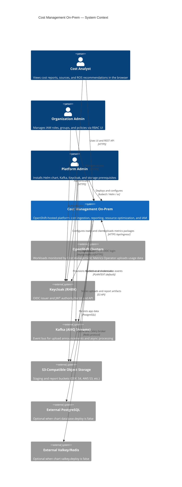

# C4 Level 1 — System context

Who interacts with Cost Management on-prem, which external systems it depends on, and where trust boundaries sit.

## System context diagram

## System description

**Cost Management On-Prem** is the software delivered by the [`cost-onprem`](../../../submodules/cost-onprem-chart/cost-onprem/) Helm chart plus prerequisite install scripts. It provides:

- **Cost Management (Koku)** — OCP-focused cost ingestion, cost models, and reporting APIs
- **Resource Optimization (ROS)** — OpenShift workload recommendations
- **IAM (insights-rbac)** — Role-based access control for APIs and the RBAC admin UI (federated in the on-prem shell)
- **Kruize** — Optimization engine used by ROS
- **Central API gateway** — Envoy validates JWTs and routes `/api/*` to internal services

SaaS ([console.redhat.com](https://console.redhat.com)) is a separate deployment model; this documentation set covers **on-prem OpenShift only**. See the chart’s [SaaS to on-prem transition diagram](../../../submodules/cost-onprem-chart/docs/saas-to-onprem-transition-diagram.svg) for product differences.

## Actors

| Actor | Goals | Typical touchpoints |
|-------|-------|---------------------|
| **Cost Analyst** | Understand cluster/project cost and optimization | UI route, `/api/cost-management/*`, ROS recommendation APIs |
| **Organization Admin** | Delegate access by cluster, namespace, or role | RBAC UI (`/iam` within shell), `/api/rbac/*` |
| **Platform Admin** | Install, upgrade, and size the stack | `scripts/install-helm-chart.sh`, `deploy-kafka.sh`, `deploy-rhbk.sh`, Helm values |

## External systems

| System | Managed by chart? | Role |
|--------|-----------------|------|
| **OpenShift clusters** | No (customer clusters) | Run workloads; **Cost Management Metrics Operator** collects Prometheus/Thanos metrics and POSTs tarballs to the platform ingress URL |
| **Keycloak (RHBK)** | No (`deploy-rhbk.sh`) | Issues JWTs for `cost-management-ui` and `cost-management-operator` audiences; oauth2-proxy uses OIDC for the UI |
| **Kafka** | No (`deploy-kafka.sh`) | `platform.upload.announce` and ROS-specific topics; connects via `kafka.bootstrapServers` in values |
| **Object storage** | Credentials only | Ingress staging bucket, Koku/ROS data buckets (`objectStorage`, `costManagement.storage`) |
| **PostgreSQL** | Optional bundled StatefulSet | Unified server with DBs `costonprem_koku`, `costonprem_ros`, `costonprem_rbac`, `costonprem_kruize` |
| **Valkey** | Optional bundled Deployment | Celery broker/backend and Django cache |

## Trust boundaries

1. **Browser ↔ platform** — TLS terminates at the OpenShift router (edge). UI traffic goes through **oauth2-proxy** (Keycloak OIDC). API traffic goes through the **Envoy gateway**, which validates JWTs and builds the `X-Rh-Identity` header for backends.
2. **JWT requirements** — Gateway expects JWT claims including `org_id` and `account_number` (see [known Keycloak profile issue](../../../wiki/entities/known-issue-keycloak-declarative-profile-jwt.md)).
3. **Operator uploads** — The Metrics Operator authenticates to `/api/ingress/` (not the interactive UI flow). Ingress trusts identity injected by the gateway and does not perform JWT validation in-pod.
4. **Internal cluster traffic** — Backend services are not exposed on public routes; NetworkPolicies restrict east-west access where templates define them.

## Next

[02-containers.md](02-containers.md) — deployable containers inside the platform boundary.
