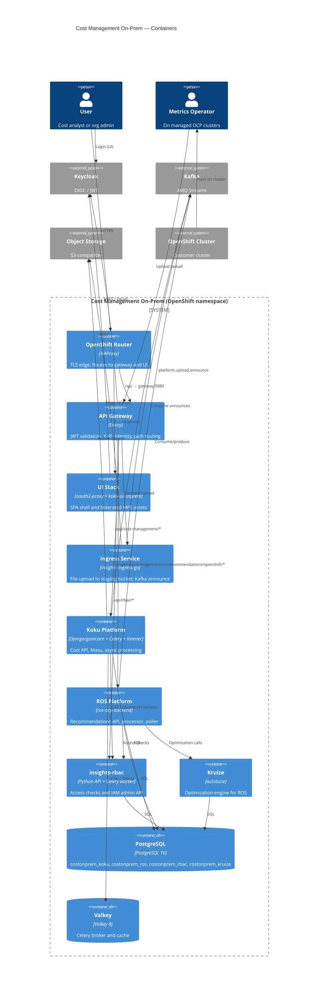

# C4 Level 2 — Containers

Deployable/runtime units inside **Cost Management On-Prem** and their primary interactions. All chart-managed workloads run in a single OpenShift namespace (for example `cost-onprem`).

## Container diagram

## Container catalog

| Container | Technology | Public entry | Internal service role |
|-----------|------------|--------------|------------------------|
| **OpenShift Router** | Route + HAProxy | `cost-onprem-api-*.apps.*`, `cost-onprem-ui-*.apps.*` | Terminates TLS; no app logic |
| **API Gateway** | Envoy (`proxyv2-rhel9`) | All `/api/*` via API Route | JWT filter; routes by path prefix (see below) |
| **UI Stack** | oauth2-proxy + nginx + static bundles | UI Route `/` | Keycloak OIDC session; serves `koku-ui-onprem` and MFE static paths (e.g. `/rbac/`) |
| **Ingress Service** | insights-ingress-go | `/api/ingress/*` (via gateway) | Multipart upload → S3 staging → Kafka topic |
| **Koku Platform** | Single `koku` image, multiple Deployments | `/api/cost-management/` | API, Masu, Kafka listener, Celery beat/workers |
| **ROS Platform** | `ros-ocp-backend` image | ROS paths via gateway | API, processor, recommendation poller, housekeeper |
| **insights-rbac** | `quay.io/cloudservices/rbac` | `/api/rbac/` | Authorization API + async worker |
| **Kruize** | `autotune` image | Internal only | Cluster-scoped optimization; ROS dependency |
| **PostgreSQL** | RHEL10 postgresql-16 StatefulSet | ClusterIP only | Multi-DB unified server (or external) |
| **Valkey** | RHEL10 valkey-8 Deployment | ClusterIP only | Broker for Koku/RBAC Celery and caching |

### Gateway path routing (order matters)

From [`configmap-envoy.yaml`](../../../submodules/cost-onprem-chart/cost-onprem/templates/gateway/configmap-envoy.yaml):

| Prefix / path | Backend |
|---------------|---------|
| `/api/cost-management/v1/recommendations/openshift` | ROS API |
| `/api/rbac/` | insights-rbac API |
| `/api/cost-management/` | Koku API (includes Sources at `/v1/sources/`) |
| `/api/ingress/ready` | Ingress readiness |
| `/api/ingress/` | Ingress upload service |

## Helm template mapping

Single umbrella chart (`dependencies: []`). Template directories under [`cost-onprem/templates/`](../../../submodules/cost-onprem-chart/cost-onprem/templates/):

| Container / workload | Kind(s) | Template directory |
|----------------------|---------|-------------------|
| API Gateway | Deployment, Service, ConfigMap, Route, NetworkPolicy | `gateway/` |
| UI Stack | Deployment, Service, ConfigMap, Route, ConsoleLink | `ui/` |
| Ingress Service | Deployment, Service, NetworkPolicy | `ingress/` |
| Koku API | Deployment, Service, ServiceAccount | `cost-management/api/` |
| Masu | Deployment | `cost-management/masu/` |
| Kafka listener | Deployment | `cost-management/` (listener templates) |
| Celery beat | Deployment | `cost-management/celery/` |
| Celery workers | Deployment (per queue) | `cost-management/celery/` |
| Koku DB migration | Job | `cost-management/jobs/` |
| ROS API | Deployment, Service | `ros/api/` |
| ROS processor | Deployment | `ros/processor/` |
| ROS recommendation poller | Deployment | `ros/recommendation-poller/` |
| ROS housekeeper | Deployment | `ros/housekeeper/` |
| ROS partition cleaner | CronJob | `ros/housekeeper/` |
| ROS DB migration | Job | `ros/jobs/` |
| insights-rbac API | Deployment, Service, ServiceMonitor | `rbac/` |
| insights-rbac worker | Deployment | `rbac/` |
| RBAC migration / bootstrap | Job | `rbac/` |
| Kruize | Deployment, ClusterRole(Binding), CronJob | `kruize/` |
| PostgreSQL | StatefulSet, Service, init ConfigMap | `infrastructure/database/` |
| Valkey | Deployment, PVC, Service | `infrastructure/cache/` |
| Storage credentials | Secret (wired by install script) | `infrastructure/storage/` |
| Prometheus scrape | ServiceMonitor | `monitoring/`, `rbac/servicemonitor.yaml` |
| Shared CA / config | ConfigMap | `shared/` |

**Not in chart:** Kafka cluster, Keycloak, S3 endpoint (only secrets and connection strings).

## Koku worker deployments (on-prem defaults)

From [`values.yaml`](../../../submodules/cost-onprem-chart/cost-onprem/values.yaml) `costManagement.celery.workers` — several cloud-only queues are scaled to **0** replicas for OCP-only posture:

| Worker | Queue | Default replicas (on-prem) |
|--------|-------|----------------------------|
| default | `celery` | 1 |
| priority | `priority` | 1 |
| summary | `summary` | 1 |
| ocp | `ocp` | 1 |
| cost_model | `cost_model` | 1 |
| refresh | `refresh` | 0 |
| hcs | `hcs` | 0 |
| subs | `subs` | 0 |
| (cloud provider queues) | aws, azure, gcp, … | 0 |

## Data stores

| Store | Consumers | Notes |
|-------|-----------|-------|
| `costonprem_koku` | Koku API, Masu, Celery | Tenant schemas `org*` for reporting data |
| `costonprem_ros` | ROS components | ROS operational data |
| `costonprem_rbac` | insights-rbac | Groups, roles, policies |
| `costonprem_kruize` | Kruize | Autotune persistence |
| Valkey | Koku, insights-rbac | `REDIS_*` / Celery broker env from helpers |
| S3 buckets | Ingress, Koku | Staging + `koku-bucket` / `ros-data` (defaults in values) |
| Kafka | Ingress (producer), Koku listener, ROS | Topic `platform.upload.announce` (ingress + listener) |

## Sources of truth

- Deployment facts: [`cost-onprem/values.yaml`](../../../submodules/cost-onprem-chart/cost-onprem/values.yaml)
- Template reference: [helm-templates-reference.md](../../../submodules/cost-onprem-chart/docs/architecture/helm-templates-reference.md)
- Platform networking: [platform-guide.md](../../../submodules/cost-onprem-chart/docs/architecture/platform-guide.md)

## Next

- [03-components-koku.md](03-components-koku.md) — inside the Koku platform
- [03-components-ui.md](03-components-ui.md) — inside the UI stack
- [data-flows.md](data-flows.md) — upload and authorization sequences
