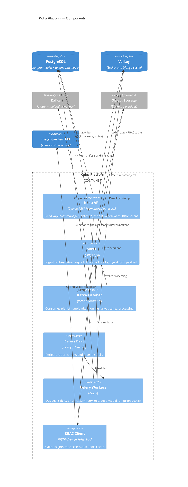

# C4 Level 3 — Koku platform components

Internal structure of the **Koku Platform** container group: multiple Deployments from one [`koku`](../../../submodules/cost-onprem-chart/cost-onprem/values.yaml) image with different entrypoints. On-prem runs with `ONPREM=True` (PostgreSQL-only, OCP data path).

## Component diagram

## Component responsibilities

### Koku API

- **Entry:** `cost-management/api` Deployment, port 8000 (metrics 9000).
- **API prefix:** `API_PATH_PREFIX=/api/cost-management` (see values).
- **Responsibilities:** Providers/sources CRUD, cost reports, tags, forecasts, cost models, settings, status.
- **Identity:** Expects `X-Rh-Identity` from Envoy (not raw JWT in application code).
- **Multi-tenancy:** Shared models in `public` schema (`Provider`, `Customer`); tenant models in `org{org_id}` schemas — requires `schema_context` / `tenant_context` ([multi-tenancy rule](../../../submodules/koku/.cursor/rules/multi-tenancy.mdc)).
- **Authorization:** `koku.rbac.RbacService` resolves permissions before filtering report queries.

### Masu

- **Entry:** `cost-management/masu` Deployment.
- **Responsibilities:** Data processing orchestration — Kafka message handling, `ingest_ocp_payload`, parquet/CSV processing in on-prem mode, manifest lifecycle.
- **On-prem path:** tar.gz → extract CSV → PostgreSQL line items (no Trino); see [onprem_data_flow.md](../../../submodules/koku/docs/onprem_data_flow.md).

### Kafka Listener

- **Entry:** dedicated listener Deployment (`costManagement.listener`).
- **Topic:** `platform.upload.announce` (same as ingress producer).
- **Consumer group:** `cost-mgmt-listener-group`.
- **Role:** Bridge from upload announcement to Masu processing pipeline.

### Celery Beat and Workers

| Component | Chart templates | Active queues (on-prem defaults) |
|-----------|-----------------|----------------------------------|
| Beat | `cost-management/celery/` | Schedules `reportDownloadSchedule` when enabled |
| Workers | per-queue Deployments | `celery`, `priority`, `summary`, `ocp`, `cost_model` at replica ≥ 1 |
| Disabled workers | replicas: 0 | `download`, `refresh`, `hcs`, `subs_*`, cloud provider queues |

Workers run pipeline steps: summarization, cost model application, OCP-specific tasks. On-prem uses `self_hosted_sql/` templates instead of Trino ([onprem-vs-saas](../../../submodules/koku/.cursor/rules/onprem-vs-saas.mdc)).

### RBAC Client (library component)

Not a separate pod — logic inside API and workers:

- Calls insights-rbac with `application=cost-management`.
- Applies returned `resourceDefinitions` as SQL/query filters.
- Caches with `RBAC_CACHE_TIMEOUT` (default 300s in chart values).

## Database layout (logical)

| Schema / DB | Apps / content |
|-------------|----------------|
| `costonprem_koku` database, `public` | `api`, `sources`, `masu`, `reporting_common` |
| `costonprem_koku`, `org*` tenant schemas | `reporting`, `cost_models` — per-customer cost data |
| Connection | `DATABASE_*` from `_helpers-koku.tpl`; `ONPREM=True` |

## External interfaces

| Interface | Protocol | Notes |
|-----------|----------|-------|
| REST clients | HTTP | Via gateway only in production |
| insights-rbac | HTTP cluster DNS | `RBAC_SERVICE_*` env vars |
| Kafka | PLAINTEXT (default) | `INSIGHTS_KAFKA_HOST` / port |
| S3 | AWS SDK path-style | `S3_ENDPOINT`, `REQUESTED_BUCKET`, ROS bucket |
| Valkey | Redis protocol | Celery + caches |

## Sources of truth

- Chart env and replicas: [`values.yaml`](../../../submodules/cost-onprem-chart/cost-onprem/values.yaml) `costManagement.*`
- Application architecture: [koku/AGENTS.md](../../../submodules/koku/AGENTS.md)
- On-prem data flow: [onprem_data_flow.md](../../../submodules/koku/docs/onprem_data_flow.md)

## Related

- [02-containers.md](02-containers.md) — Koku among peer containers
- [data-flows.md](data-flows.md) — upload pipeline sequence
- [03-components-ui.md](03-components-ui.md) — browser shell
