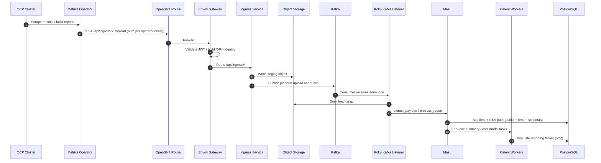
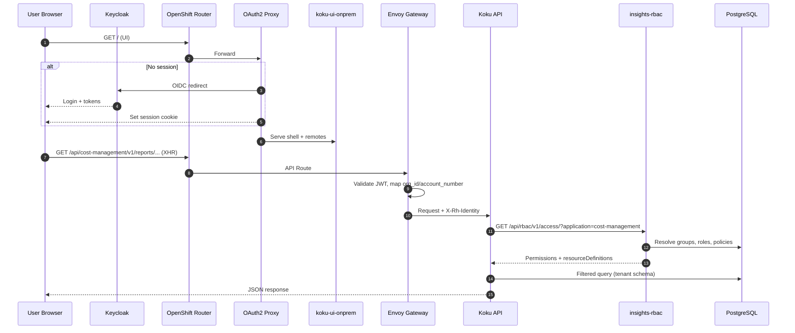

# Data flows — upload and authorization

Sequence views supplementing the C4 container model. For static pipeline art, see the chart’s [data-processing-flow.svg](../../../submodules/cost-onprem-chart/docs/data-processing-flow.svg).

## 1. Metrics operator upload (ingest)

OpenShift clusters run the **Cost Management Metrics Operator** (not deployed by `cost-onprem` chart). The operator packages Prometheus/Thanos metrics as tarballs and uploads them to the platform ingress URL.

**Key points:**

- Ingress sets `INGRESS_AUTH=false`; identity comes from the gateway header ([helm-templates-reference](../../../submodules/cost-onprem-chart/docs/architecture/helm-templates-reference.md)).
- Announce topic defaults: `platform.upload.announce` (ingress producer and Koku listener consumer).
- On-prem processing stays in PostgreSQL — no Trino ([onprem_data_flow.md](../../../submodules/koku/docs/onprem_data_flow.md)).

**Verification docs:** [operator upload checklist](../../../submodules/cost-onprem-chart/docs/operations/cost-management-operator-upload-verification-checklist.md), [force operator upload](../../../submodules/cost-onprem-chart/docs/operations/force-operator-upload.md).

## 2. Authorized API read (UI or API client)

Interactive users authenticate through Keycloak; APIs behind the gateway require a valid JWT with required claims.

**ROS path:** Same gateway JWT step; gateway routes `/api/cost-management/v1/recommendations/openshift/*` to ROS, which also calls insights-rbac with `application=cost-management`.

**RBAC admin path:** UI remote `insightsRbac` calls `/api/rbac/*` through the same gateway; authorization for those endpoints uses the `rbac` application permissions.

Reference: [rbac-setup.md](../../../submodules/cost-onprem-chart/docs/operations/rbac-setup.md) architecture sequence.

## 3. ROS ↔ Kruize (internal)

ROS components consume Kafka topics (for example `hccm.ros.events` per ROS values) and call **Kruize** for optimization experiments. Kruize holds cluster-scoped RBAC (ClusterRole in chart) to read metrics configuration. Detail: [platform-guide.md](../../../submodules/cost-onprem-chart/docs/architecture/platform-guide.md) and `kruize/` templates.

## Related

- [01-system-context.md](01-system-context.md) — external systems
- [02-containers.md](02-containers.md) — container boundaries
- [03-components-koku.md](03-components-koku.md) — listener and workers
