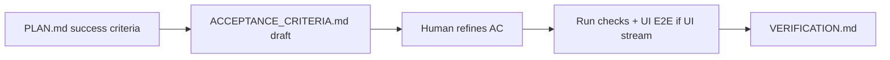

# RPI `40-verify`: acceptance criteria gate and UI E2E

Normative behavior: [`pipelines/rpi/v1/stages/40-verify/SPEC.md`](../../pipelines/rpi/v1/stages/40-verify/SPEC.md). Plan seeds criteria: [`20-plan/SPEC.md`](../../pipelines/rpi/v1/stages/20-plan/SPEC.md).

## Flow

1. Agent drafts **`ACCEPTANCE_CRITERIA.md`** under `pipelines/rpi/v1/stages/40-verify/output/<scope>/`.
2. Agent **presents** criteria in chat; human adds/removes/rewords; file updated.
3. **Only after confirmation** — run automated checks and (when UI-modifying) **exercise the UI end-to-end** per criterion.
4. Record evidence in **`VERIFICATION.md`** (per-criterion pass/fail).

## UI-modifying streams

**Yes** when any: edits in `koku-ui`, `sources-ui`, or `insights-rbac-ui`; frontend file patterns (`*.tsx`, routes/pages/components); plan/scope explicitly targets in-browser behavior.

**E2E means:** full user path (e.g. login → navigate → act → visible outcome), not unit tests alone. Use Playwright/Cypress when the submodule documents them; otherwise browser automation or documented manual steps with URL and evidence.

**On-prem live Cypress (`koku-ui-onprem/cypress/e2e/live/`):** local-only via `test:cypress:live` after `start:onprem:dev` — **not** a CI gate. See [onprem-playwright-e2e.md](onprem-playwright-e2e.md). Record pass/fail in **`VERIFICATION.md`** from developer runs; do not assume PR CI ran the suite.

## Non-code / Jira-only streams

Still create **`ACCEPTANCE_CRITERIA.md`** (criteria against Jira/plan; **UI-modifying: no**). Skip UI exercise; evidence in **`VERIFICATION.md`** from Jira state and checklist.

## `@rpi-status`

**40-verify** expects `ACCEPTANCE_CRITERIA.md` and `VERIFICATION.md`. AC present without verification → **In progress** (awaiting human AC sign-off or execution).
